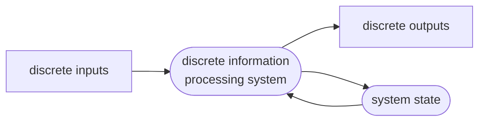
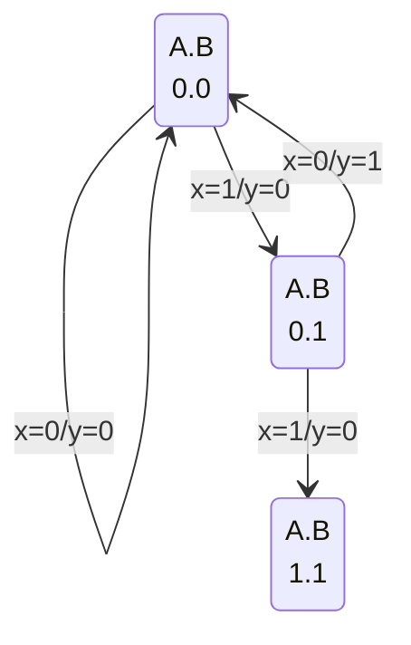
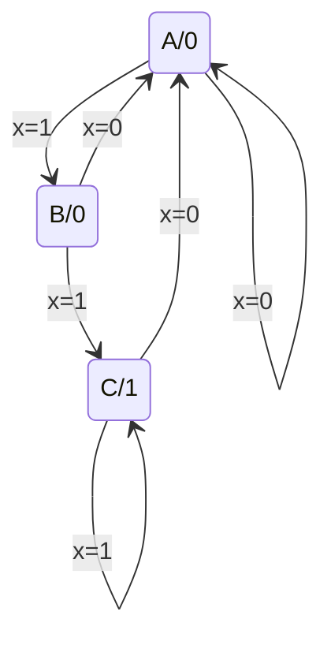
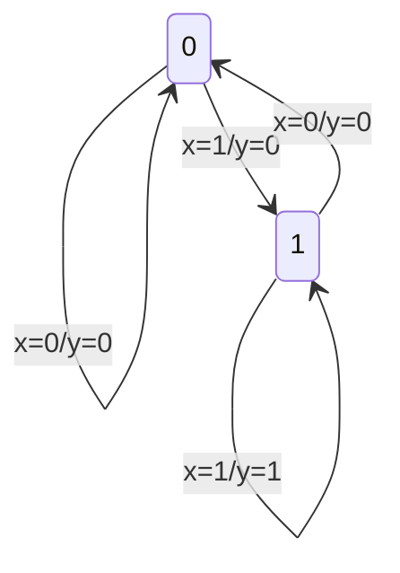

# 数逻

> 好乱的笔记，不建议看…还缺斤少两的

### assessment

* Theory: 70%
  – Quizzes 40% * 70% = 28%
  – Projects: 20% *70 = 14%
  – The final Examination: 40%*70% = 28%
*  Necessary condition: the score ≥50
   Experiments: 30%
* Quizzes
  – Not regular and without notification (once every 2-3 weeks)
  – Questions are from textbook and home assignments
*  **Project:**
  **– The source code, source project and technical report should be submitted**
  **– The technical report: including the analysis and design process, the debugging process, and the simulation sequential diagram**
  **– Deadline: One week after the final examination**
* English / Chinese

Requirements of Experiments

* Study Verilog HDL language by yourself
* In advance of each experiment related to Verilog HDL, every one should input and debug the Verilog source code and perform the behavior simulation

---

## digital systems and information

### digital system and computers

types of digital systems:

* Combinational Logic System
  – No state present
  – Output = Function(Input)
* Sequential System
  – State present
  – State updated at discrete times
  => **Synchronous** Sequential System (同步的，正确度，离散的|固定时间变化的)
  – State updated at any time
  =>**Asynchronous** Sequential System (异步的，效率，即时变化的)
  – State = Function (State, Input)
  – Output = Function (State)
  or Function (State, Input)

### information representation

signal example – physical quantity

### number system(binary, octal, hexadecimal)

positional number system(binary for example):

radix(base): r = 2 
digitals: 0, 1
radix point
weight: W~i~ = 2^i^

### coding – decimal code

* By the binary number system, binary numbers can
  represent decimal numbers. However,
*  Computers input and output data used by most people
  need to be in the decimal system. Working in the
  manner of the decimal system is highly important.

#### decimal codes – binary coded decimal(BCD)

| Decimal | 8,4,2,1 | Excess 3 | 8,4,-2,-1 | Gray |
| :-----: | :-----: | :------: | :-------: | :--: |
|    0    |  0000   |   0011   |   0000    | 0000 |
|    1    |  0001   |   0100   |   0111    | 0100 |
|    2    |  0010   |   0101   |   0110    | 0101 |
|    3    |  0011   |   0110   |   0101    | 0111 |
|    4    |  0100   |   0111   |   0100    | 0110 |
|    5    |  0101   |   1000   |   1011    | 0010 |
|    6    |  0110   |   1001   |   1010    | 0011 |
|    7    |  0111   |   1010   |   1001    | 0001 |
|    8    |  1000   |   1011   |   1000    | 1001 |
|    9    |  1001   |   1100   |   1111    | 1000 |

redundancy 冗余码
（in the form of extra bits, can be incorporated into 
binary code words to detect and correct errors.）（lg: Parity)

ASCII (American Standard Code for Information Interchange):
0 ~ 9 : 30~16~ — 39~16~
Upper case A ~ Z : 41~16~ – 5A~16~
Lower case a ~ z : 61~16~ – 7A~16~

---

## combinational logic circuits

实实在在的电路——做不做得出来、成本面积速度

logical operations: AND OR NOT

truth tables

logic  gates: relays(继电器)—vacuum tubes(真空管)—transistors(晶体管)

**gate delay**: the output change does not occur instantaneously

NAND: logically complete

AOI: AND-OR-INVERT

**boolean equations(布尔代数式)**: lg A( (BC’) + D )
(Truth tables are unique; expressions and logic diagrams are not. This gives flexibility in implementing functions.)

order: ( ) > NOT > AND >OR   **X + YZ = (X + Y)(X + Z)**

The **dual(对偶)** of an algebraic expression is obtained by interchanging + and · , and replacing 0s by 1s and 1 by 0.
**self-dual(自对偶)** H = AB + BC + AC

**complementing functions(反函数)**

* difference: 对偶-变量不取反

#### [canonical forms]: SOM/POM

**sum of minterms(SOM)**:
minterms: XYZ(m~7~), XYZ’(m~6~), X’Y’Z’(m~0~)…下标使组合为1
f = m~3~ + m~2~ + m~0~ = ∑~m~(0, 2, 3)

**product of maxterms(POM)**:
maxterms: X+Y+Z(M~0~), X+Y+Z’(M~1~), X’+Y’+Z’(M~7~)…下标使组合为0
f = M~2~ ·M~3~ = Π~M~(2, 3)

M~i~ = m~i~’  m~i~ = M~i~’ 
We can implement any function by **"ORing" the minterms** corresponding to **"1"** entries in the function table. These are called the minterms of the minterms of the function.(**“ANDing”,maxterms,”0”**)

**F(x, y, z) = ∑~m~(1, 3, 5, 7) :**
**F’(x, y, z) = ∑~m~(0, 2, 4, 6) = Π~M~(1, 3, 5, 7)**

#### [standard forms]: SOP/POS

**standard sum of products(SOP)**: F = Y’ + X’YZ’ + XY
**standard product of sums(POS)**: F = X(Y’ + Z)(X + Y + Z’)

#### other gate types:

Buffer (F = X) 

the 3-StateBuffer (when EN = 0, whatever IN is, OUT = Hi-Z)

Transmission Gate (can be regarded as a switch)

Hi-Z: 数字电路常见术语，指的是电路的一种输出状态，既不是高电平也不是低电平，如果高阻态再输入下一级电路的话，对下级电路无任何影响，和没接一样，如果用万用表测的话有可能是高电平也有可能是低电平，随它后面接的东西定。

#### circuit optimization:

cost criteria（成本标准）:

• Literal cost (L)
• Gate input cost (G)
• Gate input cost with NOTs (GN)

#### boolean function optimization:

Karnaugh Maps (K-map) , dimension of squares

#### Systematic Simplification:

Prime Implicant (质蕴含项)

Essential Prime Implicant(基本质蕴含项)

---

## Combinational Logic Design

### implementation technology and logic

**combinational circuits(组合电路):**

m Boolean inputs, n Boolean outputs, and n switching functions, each mapping the 2^m^ input combinations to an output such that the current output depends only on the current input values

**Technology Parameters(工艺参数):**

* Fan-in – the number of inputs available on a gate
* Fan-out – the number of standard loads driven by a gate output 
* Logic Levels – the signal value ranges for 1 and 0 on the inputs and 1 and 0 on the outputs (see Figure 1-1)
* Noise Margin – the maximum external noise voltage superimposed on a normal input value that will not cause an undesirable change in the circuit output
* Cost for a gate - a measure of the contribution by the gate to the cost of the integrated circuit
* Propagation Delay(传输延迟) – The time required for a change in the value of a signal to propagate from an input to an output
  * transport delay(输送延迟)
  * inertial delay(惯性延迟):rejection time
* Power Dissipation – the amount of power drawn from the power supply and consumed by the gate

**Design procedure:**

specification-formulation-optimization-technology mapping-verification

beginning hierarchical(分层的) design

Top-down, Bottom-up

mapping to NAND / NOR gates

### combinational logic:

function block

Rudimentary (基本的) logic functions

Enabling function (使能)

Decoding and decoder (解码器)  generate Minterms
lg: two 1-to-2-Line Decoders and four AND gates can generate one 2-to-4-Line Decoder
n-to-2^n^-Line Decoder: even 2 x 2^k/2^ odd 2^(k+1)/2^ + 2^(k-1)/2^

Encoding and encoder (编码器)

Multiplexer (选择器)

> We will refer to the combination of AND gates and OR gates as an m $\times$ 2 AND-OR, where m is the number of AND gates and 2 is the number of inputs to the AND gates.

### Arithmetic Functions

#### Iterative combinational circuits

* Arithmetic functions
  • Operate on binary vectors
  • Use the same subfunction in each bit position
*  Can design functional block for subfunction and repeat to obtain functional block for overall function
* *Cell* - subfunction block
* Iterative array - an array of interconnected cells
*  An iterative array can be in a single dimension (1D) or multiple dimensions

#### Binary adders

##### Half-Adder

a half adder adds two bits to produce a two-bit sum (a sum bit S and a carry bit C)

S = X $\bigoplus$ Y = XY’ + X’Y = (X+Y) (X’+Y’)

C = XY

##### Full-Adder

includes a carry-in bit from lower stages

S = X $\bigoplus$ Y $\bigoplus$ Z = XY’Z’ + X’YZ’ + X’Y’Z + XYZ

C = XY + XZ + YZ = XY + (X $\bigoplus$ Y)Z

##### Ripple Carry Adder (纹波进位加法器)

a n-bit Ripple Carry Adder made from n 1-bit Full Adders

One problem with the addition of binary numbers is the length of **time** to **propagate** the ripple carry from the least significant bit to the most significant bit.

##### Carry-Look-Ahead Adder (超前进位加法器)

G~i~ (generate): A~i~B~i~

P~i~ (propagate): A~i~ $\bigoplus$ B~i~ 

S~i~ = P~i~ $\bigoplus$ C~i~

C~i+1~ = G~i~ + P~i~C~i~

C~i~ can be removed from the cells and used to derive a set of carry equations spanning multiple cells

This could be extended to more than four bits, but in practice, due to limited gate fan-in, such extension is not feasible. Solution:

G~0-3~ = G~3~ + P~3~G~2~ + P~3~P~2~G~1~ +  P~3~P~2~P~1~G~0~

P~0-3~ = P~3~P~2~P~1~P~0~

C~4~ = G~0-3~ + P~0-3~C~0~

#### Binary subtraction

* Subtract the subtrahend N from the minuend M
* If no end borrow occurs, then M $\geq$ N, and the result is a non-negative number and correct.
* If an end borrow occurs, then N > M and the difference M - N + 2^n^ is subtracted from 2^n^, and a minus sign is appended to the result.
* The subtraction, 2^n^ - N, is taking the 2’s complement of N

##### Complements

**Diminished Radix Complement of N:**

(r - 1)’s complement for radix r, define as (r^n^ - 1) - N

**Radix Complement:**

r’s complement for radix r: r^n^ - N

##### Subtraction with 2’s complement

For n-digit, unsigned numbers M and N, find M - N in base 2:

* Add the 2's complement of the subtrahend N to the minuend M:
  M + (2^n^ - N) = M - N + 2^n^
* If M > N, the sum produces end carry r^n^ which is discarded; from above, M - N remains.
* If M < N, the sum does not produce an end carry and, from above, is equal to 2^n^ - ( N - M ), the 2's complement of ( N - M ).
*  To obtain the result - (N – M) , take the 2's complement of the sum and place a - to its left.

#### Binary adder-subtractors

signed integers representations: signed-magnitude, signed-complement

overflow detection: V = C~n~ $\bigoplus$ C~n-1~ 

#### Binary multiplication

#### Other arithmetic functions

convenient to design the functional blocks by *contraction* (收缩) — removal

of redunancy from circuit to which input fixing has been applied

functions: 

* incrementing
* decrementing 
* multiplication by constant
* division by constant
* zero fill and extension

---

## Sequential Circuits

### Storage Elements and Sequential Circuit Analysis

#### A Sequential circuit contains:

* Storage elements: Latches (锁存器) or Flip-Flops (触发器)
* Combinational Logic

#### Types of  sequential circuits:

* depends on the times at which: storage elements observe their inputs and change their state
* **Synchronous** (同步的) : Behavior defined from knowledge of its signals at discrete instances of time; Storage elements observe inputs and can change state only in relation to a timing signal (clock pulses from a clock)
* Asynchronous (异步的) : Behavior defined from knowledge of inputs an any instant of time and the order in continuous time in which inputs change; If clock just regarded as another input, all circuits are asynchronous!; Nevertheless, the synchronous abstraction makes complex designs tractable!

Discrete event simulation (离散事件模拟/仿真)

#### Latches (锁存器)

$Basic\;\overline S-\overline R\;Latch$ : two NAND gates

$Basic\;S-R\;Latch$: two NOR gates

$Clock\;S-R\;Latch$: adding two NAND to the $Basic\;\overline S-\overline R\;Latch$ 

| C    | S    | R    | Q(t+1)        |
| ---- | ---- | ---- | ------------- |
| 0    | X    | X    | No Change     |
| 1    | 0    | 0    | No Change     |
| 1    | 0    | 1    | 0: Clear Q    |
| 1    | 1    | 0    | 1: Set Q      |
| 1    | 1    | 1    | Indeterminate |

$D\;Latch$ : adding an inverter to the S-R Latch (No ‘indeterminate’ states)

> D锁存器的缺点：存在空翻现象——如果D锁存器直接用在时序电路中作为状态存储元件，当使能控制信号有效时，会导致该元件内部的状态值随时多次改变，而不是保持所需的原始状态值
>
> 解决办法：用两个锁存器，主锁存器在脉冲控制下**接收**输入数据，从锁存器在脉冲结束后**改变并保持**状态。

#### Flipflop (触发器)

$S-R\;Master-Slave\;Flip-Flop$ : 

> 在有脉冲（高电平）时，修改第一个锁存器的值，保持第二个锁存器的值；在没有脉冲（低电平）时候保持第一个锁存器的值，修改第二个锁存器的值，更新触发器的状态。

The input is observed by the first latch with C = 1
The output is changed by the second latch with C = 0
( Problem: delay, S/R are permitted to change while C = 1 )

$Edge-Triggered\;D\;Flip-Flop$ : 

> 仅在时钟的边缘触发，即在特定时刻仅接受一个输入。
> （正边沿）关注上升沿前后，上升沿前一刻，主锁存器可写，从锁存器只读；上升沿后一刻，主锁存器只读，从锁存器只写，且写入的是主锁存器存储的值——换句话来说，存的是上升沿前一刻写入主锁存器的内容。

The delay of the S-R master-slave flip-flop can be avoided since the 1s-catching behavior is not present with D replacing S and R inputs.
The change of the D flip-flop output is associated with the negative edge at the end of the pulse.
(also called a *negative-edge triggered flip-flop* )

*standard flip-flop (Positive-Edge Triggered D Flip-Flop)* * not actual used one

STANDARD SYMBOLS:

#### Direct inputs:

At power up or at reset, all or part of a sequential circuit usually is initialized to a known state before it begins operation.

This initialization is often done outside of the clocked behavior of the circuit.

direct R and S inputs that control the state of the latches within the flip-flops are used for this initialization. (S=1,Q=1;R=1,Q=0)

#### Sequential Circuit Analysis

**General Model：**

output = Boolean function of state (and input).

state =  Boolean function of  **last** state and input.

**State Table：**

present state, input, next state, output

(当前状态的分析和定义有很多不同情况)

**State Diagrams:**

* A *circle* with the *state name* in it for each state
* A *directed arc* from the Present State to the Next State for each *state transition*
* A *label* on each directed arc with the *Input values* which causes the state transition, and a label on each circle with th*e output value* produced, or on each directed arc with the output value produced.

**Equivalent State Definitions:**

Two states are equivalent if their response for each possible **input** sequence is an identical output sequence.
Alternatively, two states are equivalent if their **outputs** produced for each input
symbol is identical and their **next states** for each input symbol are the same or equivalent.

**Finite State Machines (FSMs)** : Sequential Circuits or Sequential Machines

**Moore Model Diagrams:** maps states to outputs

**Mealy Model Diagrams:** maps inputs and state to outputs

Mixed Moore and Mealy Outputs

#### Flip-Flop Parameters (参数)

| t     | mean                   |
| ----- | ---------------------- |
| t~s~  | setup time             |
| t~h~  | hold time              |
| t~w~  | clock pulse width      |
| t~px~ | propagation delay      |
| t~pd~ | max( t~PHL~ , t~PLH~ ) |

#### Circuit and System Level Timing

t~p~ = t~stack~ +( t~pd,FF~ + t~pd,COMB~ + t~s~), t~stack~ is greater than or equal to zero

### Sequential Circuit Design

#### The Design Procedure

* Specification
* Formulation - Obtain a state diagram or state table
* State Assignment - Assign binary codes to the states
* Flip-Flop Input Equation Determination - Select flip-flop types and derive flip-flop equation from the next state entries in the table
* Output Equation Determination - Derive output equations from output entries in the table
* Optimization - Optimize the equations
* Technology Mapping - Find circuit from equations and map to flip-flop and gate technology
* Verification - Verify correctness of final design

#### Sequence Recognizer Procedure

* Begin in an **initial state** in which NONE of the initial portion of the sequence has occurred (typically “reset” state).
*  Add a state that recognizes that the first symbol has occurred.
* Add states that recognize each successive symbol occurring.
* The final state represents the **input sequence** (possibly less the final input value) occurrence.
* Add state transition arcs which specify what happens when a symbol **not** in the proper sequence has occurred.
* Add other arcs on non-sequence inputs which transition to states that represent the input subsequence that has occurred.

#### Formulation: Find State Table

| Present State | Next State x=0  x=1 | Output x=0  x=1 |
| ------------- | ------------------------ | -------------------- |
| A             | A  B                     | 0  0                 |
| B             | …                        | …                    |
| C             | …                        | …                    |

> Mealy Model

| Present State | Next State x=0  x=1 | Output |
| ------------- | ------------------------ | ------ |
| A             | A  B                     | 0      |
| B             | …                        | …      |
| C             | …                        | …      |

> Moore Model

Mealy Model侧重记录输入前的状态；Moore Model侧重输入后的状态
`Moore is More`

#### 状态表的简化

**等效状态：**设状态S1和S2是完全确定状态表中的两个状态,如果对于所有可能的输入序列，分别从状态S1和状态S2出发，所得到的输出响应序列完全相同，则状态S1和S2是等效的，记作(S1, S2), 或者说，状态S1和S2是等效对。
等效状态可以合并。这里“所有可能的输入序列”是指长度和结构是任意的，它包含无穷多位，且有无穷多种组合。

> 输出相同 & ( 次态相同 | 次态交错 | 次态循环 )

观察法、隐含表法（处于循环链中是等效的:互相依赖的是等效的）

#### 状态分配

任务：决定编码的长度，寻找一种最佳的或接近最佳的状态分配方案

原则：

* **在相同输入条件下具有相同次态的现态，应尽可能分配相邻的二进制代码**
* 在相邻输入条件，同一现态的次态应尽可能分配相邻的二进制代码
* 输出完全相同的现态应尽可能分配相邻的二进制代码
* 最小化状态表中出现次数最多的状态或初始状态应分配逻辑0

#### Other Flip-Flop Types

**J-K Flip-flop:** 
J = K = 1 is allowed, and the flip-flop changes to the opposite state
has some “1’s catching” behavior as S-R flip-flop
if the master changes to the wrong state, it will be passed to the slave

**T Flip-flop:** 
T = 0, no change to state; T = 1, changes to opposite state
J-K flip-flop with J = K = T
“1’s catching”
cannot be initialized to a known state using the T input (Reset essential)

#### Basic Flip-flop Descriptors

Characteristic Table:

| D    | Q(t+1) | Operation |
| ---- | ------ | --------- |
| 0    | 0      | Reset     |
| 1    | 1      | Set       |

Characteristic Equation:

> Q(t+1) = D
> Q(t+1) = T $\otimes$ Q
> Q(t+1) = S + R’ Q,  S · R = 0
> Q(t+1) = J Q’ + K’ Q  (**AB+A’ C+BC = AB + A’ C**) 

Excitation Table:

| Q(t+1) | D    | Operation |
| ------ | ---- | --------- |
| 0      | 0    | Reset     |
| 1      | 1    | Set       |

### State Machine Design

---

##  Digital Hardware Implementation

### The Design Space

### Programmable Implementation Technologies

    
Why Programmable Logic

     
    Facts:
    It is most economical to produce an IC(集成电路) in large volumes 
    Many designs required only small volumes of ICs 
     
    Need an IC that can be: 
    Produced in large volumes 
    Handle many designs required in small volumes 
     
    A programmable logic part can be: 
    made in large volumes 
    programmed to implement large numbers of different low-volume designs 
     

    
Programmable Logic-More Advantages

     
    Many programmable logic devices are field-programmable can be programmed outside of the manufacturing environment 现场可编程的，即可以在制造环境之外进行编程 
    Most programmable logic devices are erasable and
reprogrammable 可擦除的，可重新编程的 
    Programmable logic devices can be used to prototype
design that will be implemented for sale in regular ICs(可用于原型设计) 

    
Programming Technologies

     
    Programming technologies are used to: 
    Control connections,Build lookup tables,Control transistor switching 

    
Technology Characteristics

     
    Permanent-cannot be erased and reprogrammed 
    Mask programming,Fuse,Antifuse 
     
    Reprogrammable 
    Volatile-Programming lost if chip power lost:single-bit storage element 
    Non-Volatile:erasable,electrically erasable,flash(as in flash memory)

#### Programmable Configuration

* **Read Only Memory (ROM):** a fixed array of AND gates and a programmable array of OR gates
* **Programmable Array Logic (PAL)**: a programmable array of AND gates feeding a fixed array of OR gates
* **Programmable Logic Array (PLA)**: a programmable array of AND gates feeding a programmable array of OR gates
* **Complex Programmable Logic Device (CPLD) / Field-Programmable Gate Array (FPGA)**: complex enough to be called “architectures”

---

## Registers and Register Transfers

### Registers, Microoperations and Implemenetations

**Register**: a collection of binary storage elements

**Register Design Models**: 

* Add predefined combinational circuits to registers
* Design individual cells using the state diagram / state table model and combine them into a register (Output is usually the state variable)

**Register Storage and Load Enable**: Load = 1, load the values on the data inputs; Load = 0, store the values in the register.

* **Registers with Clock Gating**: the $\overline {Load}$ signal enables the clock signal to pass through if 0 and prevents the clock signal from passing through if 1. $Gated\;Clock\;=Clock+\overline{Load}$.
  Problem: Clock Skew of gated clocks with respect to clock or each other
* **Registers with Load-Controlled Feedback**: Run the clock continuously, and selectively use a load control to change the register contents.
  (Example) 2-bit register: Load = 0, loads register contents; = 1, input  values.

**Register Transfer Operations**: 
the movement and processing of data stored in registers
three basic components: set of registers, operations, control of operations
Elementary Operations (Microoperations): load, count, shift, add, bitwise”OR”, etc

**Register Notation**: 

* Letters and numbers – denotes a register (ex. R2, PC, IR)
* Parentheses ( ) – denotes a range of register bits (ex. R1(1), PC(7:0), PC(L))
*  Arrow ($\leftarrow$) – denotes data transfer (ex. R1 $\leftarrow$R2, PC(L) $\leftarrow$ R0)
* Comma – separates parallel operations
* Brackets [ ] – Specifies a memory address (ex. R0 $\leftarrow$ M[AR], R3 $\leftarrow$ M[PC] )

**Conditional Transfer**: If (K1 = 1) then (R2$\leftarrow$R1) is shortened to **K1: (R2$\leftarrow$R1)**

**Control Expressions**:
appears to the left of the operation and is separated from it by a colon
specify the logical condition for the operation to occur
(Example) $\overline X\;K1:R1\leftarrow R1 + R2$

**Microoperations**:

* Logical Groupings:
  * Transfer - move data from one register to another
  * Arithmetic - perform arithmetic on data in register (+ - * /)
  * Logic - manipulate data or use bitwise logical operations ($\or\;\and\;\otimes\;\overline{}$ )
  * Shift - shift data in registers

> NOTE: 
> "+" means “OR” in K1 + K2; and means “plus” In R1 $\leftarrow$ R1 + R3

| Symbolic Designation              | Description            |
| --------------------------------- | ---------------------- |
| $R0\leftarrow R1+R2$              | Addition               |
| $R0\leftarrow \overline{R1}$      | One’s Complement       |
| $R0\leftarrow \overline{R1}+1$    | Two’s Complement       |
| $R0\leftarrow R2+\overline{R1}+1$ | R2 minus R1            |
| $R0\leftarrow R1+1$               | Increment (count up)   |
| $R0\leftarrow R1-1$               | Decrement (count down) |

| Symbolic Designation         | Description                     |
| ---------------------------- | ------------------------------- |
| $R0\leftarrow \overline{R1}$ | Bitwise NOT                     |
| $R0 \leftarrow R1\or R2$     | Bitwise OR (set bits)           |
| $R0 \leftarrow R1\and R2$    | Bitwise AND (clears bits)       |
| $R0 \leftarrow R1\otimes R2$ | Bitwise EXOR (complements bits) |

| Symbolic Designation  | Description | ( R2 = 11001001) R1 |
| --------------------- | ----------- | ------------------- |
| $R1\leftarrow sl\;R2$ | Shift Left  | 10010010            |
| $R1\leftarrow sr\;R2$ | Shift Right | 01100100            |

**Register Transfer Structures**: 

* **Multiplexer-Based Transfers** - Multiple inputs are selected by a multiplexer dedicated to the register
  

  

   simultaneous: 同步的

* **Bus-Based Transfers** - Multiple inputs are selected by a shared multiplexer driving a bus that feeds inputs to multiple registers
  

* **Three-State Bus** - Multiple inputs are selected by 3-state drivers with outputs connected to a bus that feeds multiple registers
  

* **Other Transfer Structures** - Use multiple multiplexers, multiple buses, and combinations of all the above.

**Shift Registers**: 
serial input (串行输入), shift right input (右移输入)
serial output (串行输出), parallel output (并行输出)

> LSB是“最低有效位”（Least Significant Bit）的缩写，是指在二进制数中最右边的一位。在计算机科学中，LSB通常用于表示数字的二进制表示中的最后一位。MSB是“最高有效位”（Most Significant Bit）的缩写。

### Counters, Register Cells, Buses, &Serial Operations

**Counters**: sequential circuits which "count" through a specific state sequence. They can count up, count down, or count through other fixed sequences. Two
distinct types are in common usage:

* Ripple Counters (for n bits, total worst case delay is n t~PHL~)
* Synchronous Counters
  
  
  
* Other Counters
  * Down Counter
  * Up-Down Counter
  * Parallel Load Counter
    
  * Divide-by-n Counter

### Control of Register Transfers

---

## Memory Basics

### Memory Definitions

* Memory ─ A collection of storage cells together with the necessary circuits to transfer information to and from them.
* Memory Organization ─ the basic architectural structure of a memory in terms of how data is accessed.
* Random Access Memory (RAM) ─ a memory organized such that data can be transferred to or from any cell (or collection of cells) in a time that is not dependent upon the particular cell selected.
* Memory Address ─ A vector of bits that identifies a particular memory element (or collection of elements).

* Typical data elements are: bit, byte, word

* Memory Data ─ a bit or a collection of bits to be stored into or accessed from memory cells.

* Memory Operations ─ operations on memory data supported by the memory unit. Typically, *read* and *write* operations over some data element (bit, byte, word, etc.).
  

  

### RAM Integrated Circuits

* Types of random access memory:
  * Static: information stored in latches
  * Dynamic: information stored as electrical charges on capacitors

* Dependence on Power Supply
  * Volatile: loses stored information when power turned off
  * Non-volatile: retains information when power turned off

#### Static RAM

Storage cell: SR Latch, Select input for control, Dual Rail Data Input B and B’, Dual Rail Data Output C and C’

8 x 2 RAM: 8 words, 2 bits

#### Dynamic RAM (DRAM)

* Basic Principle: Storage of information on capacitors (电容器)
* Charge and discharge of capacitor to change stored value
* Use of transistor as “switch” to Store charge and Charge or discharge

DRAM Types:

* Synchronous DRAM (SDRAM)
* Double Data Rate SDRAM (DDR SDRAM)
* RAMBUS DRAM (RDRAM)

