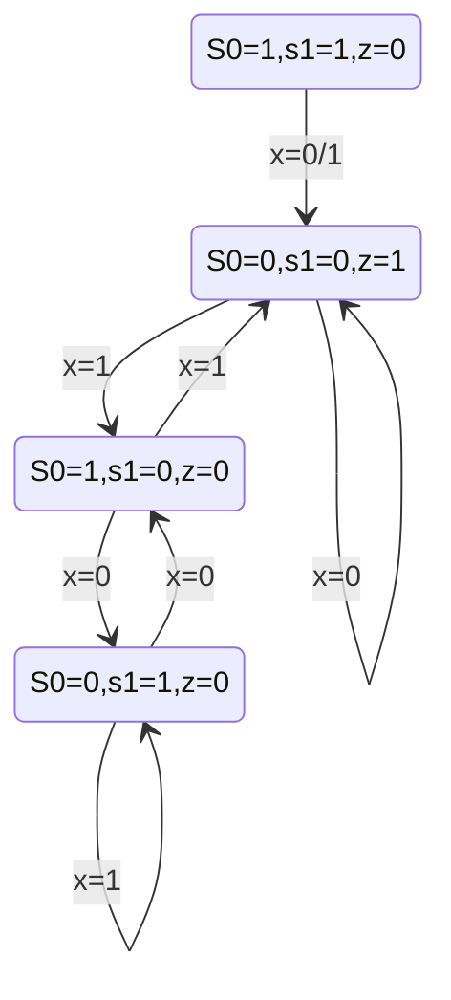

# hw3

3.53

| \ cycle |  0   |  1   |  2   |  3   |  4   |  5   |  6   |  7   |
| :-----: | :--: | :--: | :--: | :--: | :--: | :--: | :--: | :--: |
|   D2    |  0   |  1   |  1   |  1   |  1   |  0   |  0   |  0   |
|   D1    |  0   |  1   |  1   |  0   |  0   |  1   |  1   |  0   |
|   D0    |  0   |  1   |  0   |  1   |  0   |  1   |  0   |  1   |

two-time clock, and four-time clock.

3.61
a.

|  S1  |  S0  |  X   |  Z   | S1’  | S0’  |
| :--: | :--: | :--: | :--: | :--: | :--: |
|  0   |  0   |  0   |  1   |  0   |  0   |
|  0   |  0   |  1   |  1   |  0   |  1   |
|  0   |  1   |  0   |  0   |  1   |  0   |
|  0   |  1   |  1   |  0   |  0   |  0   |
|  1   |  0   |  0   |  0   |  0   |  1   |
|  1   |  0   |  1   |  0   |  1   |  0   |
|  1   |  1   |  0   |  0   |  0   |  0   |
|  1   |  1   |  1   |  0   |  0   |  0   |

b.

4.1
Memory: storage of information
Processing Unit: computation of information
Input: devices of getting information into the computer
Output: devices of getting information out of the computer
Control Unit: ensure all the parts finish their tasks correctly and at the correct time

4.3
The program counter does not maintain a count of any sort. And the information in it is the address of the next instruction to be processed, so “Instruction Pointer” is more proper.

4.8
a. 8
b. 7
c. 3

4.10

|      | Fetch Instruction | Decode | Evaluate Address | Fetch Data | Execute | Store Result |
| :--: | :---------------: | :----: | :--------------: | :--------: | :-----: | :----------: |
|  PC  |  0001,0110,1100   |        |                  |            |  1100   |              |
|  IR  |  0001,0110,1100   |        |                  |            |         |              |
| MAR  |  0001,0110,1100   |        |                  |    0110    |         |              |
| MDR  |  0001,0110,1100   |        |                  |    0110    |         |              |

