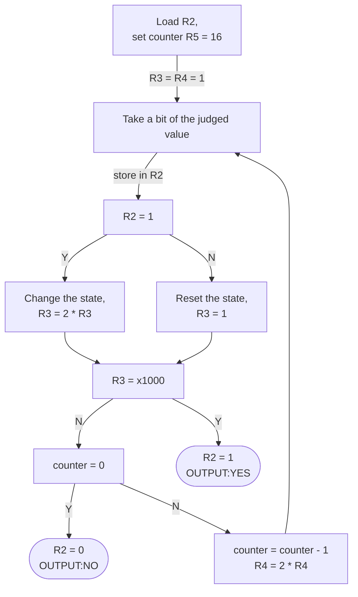

# repo-lab1

## Algorithm




## Essential parts of codes

```c
0010 0100 1111 1010 ; (LD R2, x00FA)    sec.2 main program
0101 0100 1000 0100 ; (AND R2, R2, R4)
0000 1010 0000 0110 ; (BRnp #6)         jump to sec.3
0000 0100 0000 1011 ; (BRz #11)         jump to sec.4
0001 1001 0000 0100 ; (ADD R4, R4, R4)  "continue"
0001 1011 0111 1111 ; (ADD R5, R5, #-1)
0000 0011 1111 1001 ; (BRp #-7)         jump to sec.2
0101 0100 1010 0000 ; (AND R2, R2, #0)
1111 0000 0010 0101 ; halt
```

This is the main parts(sec.2) of my codes.
The codes in line 2 take a bit of the 16-bit value. If it is 1, then we change the state(line 3, jump to sec.3). Otherwise, the 1’s is not consecutive and we reset the state(line 4, jump to sec.4).
With the new state, we return “continue” part(line 5) and decrement the counter(R~5~).
If the state is x1000(judged in sec.3), we set R~2~ to 1, meaning the 16-bit value has 3 consecutive 1’s.
However, if the counter is 0, we set R~2~ to 0, which means the 16-bit value doesn’t have 3 consecutive 1’s.

| register |                            value                             |
| :------: | :----------------------------------------------------------: |
|    R2    |                       the 16-bit value                       |
|    R3    | [state] <br/>#1000 for 3 consecutive 1’s <br/> #0100 for 2 consecutive 1’s <br/>#0010 for 1 consecutive 1’s <br/>#0001 for 0 consecutive 1’s |
|    R4    |                       operand for AND                        |
|    R5    |                           counter                            |

## Q&A

I introduced the the meaning of the registers used in the program and the algorithms used in the code to TA. 
Besides, there is a bug in my original(line 3 as I post above) that the `0000 1010 0000 0110 ; (BRnp #6)` is actually `0000 0010 0000 0110 ; (BRp #6)` before the modification. And in this way, when the data is 32768(a negative in 2’s complement, but in this code I mean a positive with a bit of 1’), the program fails to take the bit of 1’.
