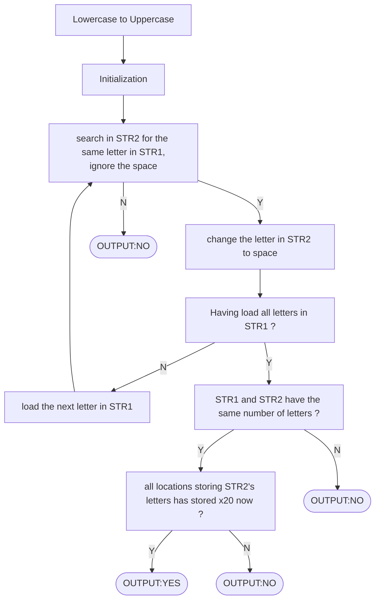

# repo-lab2

## Algorithm




## Essential parts of codes

```assembly
AGA     LD  R0,PTR1
        ADD R0,R0,R6
        LDR R2,R0,#0 ; reset R2/str1
        BRz CHARGE
        LD  R0,P2
        ADD R0,R0,R2 ; sp?
        BRz ADD1
        LD  R0,PTR2
        ADD R0,R0,R7
        LDR R3,R0,#0 ; reset R3/str2
        BRz DIF
        LD  R0,P2
        ADD R0,R0,R3 ; sp?
        BRz ADD2
        NOT R3,R3
        ADD R3,R3,#1 ; R3' = -R3
        ADD R0,R2,R3 ; R2-R3
        BRnp ADD2
        LD  R3,SP   ; store
        LD  R0,PTR2
        ADD R0,R0,R7
        STR R3,R0,#0 ; str2 -> sp
        LD  R0,NUM2  ; v
        ADD R0,R0,#1 ; v
        ST  R0,NUM2  ; NUM2++
        BRnzp SETR1
```

In this part, the codes compare the letters in STR1 and STR2.
First, the program loads the according letter in STR1(line 3), and then judges whether it is ‘zero’(line 4). If so, jump to compare their length. And if not, judges whether it is ‘x20’(the ASCII code of ‘space’). If it is, skip this location(line 7,jump to ADD1 part), and if it’s not, the program loads the according letter in STR2(line 10).
If the value is ‘one’, which means the program can not find the same letter in STR2, namely STR1 and STR2 is not ‘anagram’, jump to put ‘NO’(line 11, jump to DIF part). Otherwise, the program judges whether it is ‘x20’(line 13). If so, skip it(line 14, jump to ADD2 part). But if not, which means the program finds the same letter in STR2, so it changes it to ‘x20’(line 22),renews the number of letters in STR2(line 25), and then loads the next letter in STR1(line 26, jump to SETR1 part).

## Q&A

I introduced the the meaning of the registers used in the program and the algorithms used in the code to TA. 