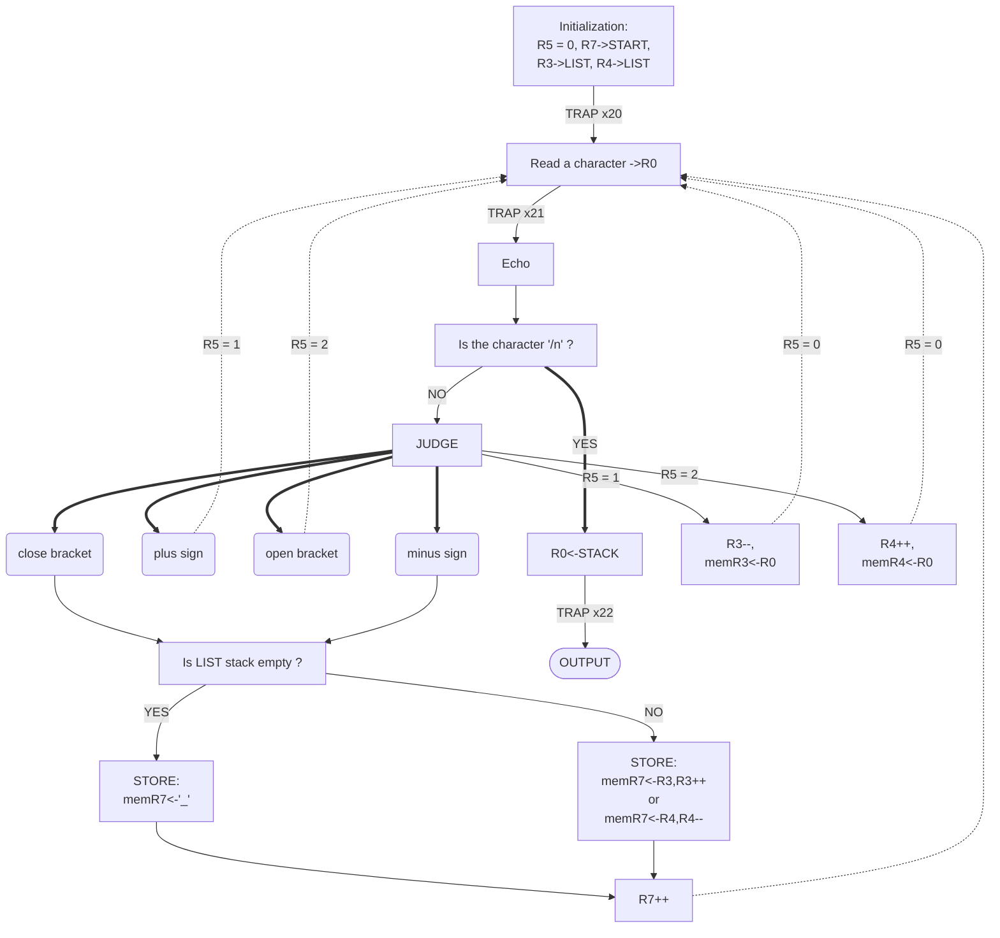

# repo-lab3

## Algorithm




## Essential parts of codes

```assembly
AL      ADD     R3,R3,#-1
        STR     R0,R3,#0
        BRnzp   AGA
AR      STR     R0,R4,#0
        ADD     R4,R4,#1
        AND     R1,R1,#0
        STR     R1,R4,#0 ; '\0'
        BRnzp   AGA
        ;
DL      LDR     R1,R3,#0
        BRnp    P
        LD      R0,UNDER
        STR     R0,R7,#0 ; store '_'
        BRnzp   Q
P       STR     R1,R7,#0
        ADD     R3,R3,#1
Q       ADD     R7,R7,#1
        BRnzp   READ
DR      NOT     R1,R3
        ADD     R1,R1,#1 ; -(R3)
        ADD     R1,R4,R1 ; R4-R3
        BRnp    X
        LD      R0,UNDER
        STR     R0,R7,#0 ; store '_'
        BRnzp   Y
X       ADD     R4,R4,#-1
        LDR     R1,R4,#0
        STR     R1,R7,#0
        AND     R1,R1,#0
        STR     R1,R4,#0 ; '/0'
Y       ADD     R7,R7,#1
AGA     AND     R5,R5,#0
        BRnzp   READ
```

This is the essential part of my codes, which achieves four operations——`+a`(AL part),`[a`(AR part),`-`(DL part),`]`(DR part).(There ‘a’ is an arbitrary character from ‘a’ to ‘z’ or from ‘A’ to ‘Z’.)
Before this part, the program has judged which operation it is, and set R5(the state) to the according number(having loaded ‘+’ when R5 is ‘1’, and loaded ‘[’ when R5 is ‘2’). So we can start with according part(one of AL, AR, DL and DR) now.

Part AL and part AR are almost the same, cause they all store the character(loaded in R0 now) in the LIST stack(line 2, line 7). It is better to know that this program have two stack parts, one to store the character(LIST stack with initial address x4000), and another to store the character needed to putout(START stack with initial address x4100). And return to the codes, before storing, the program change R3/R4(the head/tail pointer) for next storage(line 1, line 5).

Part DL and part DR are similar, too. And that’s because they are all in charge of storing the special character into the START stack(the stack for output). But before the storage, the program judge whether the LIST stack is empty. If so, it just puts a ‘_’  into the START stack, and return to read the next character. If not, it stores the special character into the START stack, increments the pointer of address(R7 in START stack), and return to read new character.

## Q&A

I talked about the idea of writing code, and introduced the the meaning of the registers used in the program and the algorithms used in the code to TA. 
