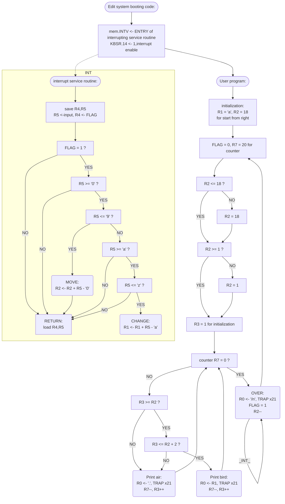

# repo-lab4(ddl 7.27)

## Algorithm




## Essential parts of codes

```assembly
; interrupt service routine
        .ORIG   x2000
        STR     R4,R6,#-1
        STR     R5,R6,#-2
        ;
        LDI     R5,KBDR ; input -> R5
        LDI     R4,JFLAG ; []
        BRz     R       ; FLAG = 0
        LD      R4,NUMS
        ADD     R4,R5,R4
        BRn     R       ; R5 < '0'
        LD      R4,NUML
        ADD     R4,R5,R4
        BRnz    MOVE    ; ('0' <=) R5 <= '9'
        LD      R4,CHAS
        ADD     R4,R5,R4
        BRn     R       ; R5 < 'a'
        LD      R4,CHAL
        ADD     R4,R5,R4
        BRnz    CHANGE  ; ('a' <=) R5 <= 'z'
        BR      R
        ;
MOVE    LD      R4,NUMS
        ADD     R5,R5,R4
        ADD     R2,R2,R5
        BR      R
CHANGE  LD      R4,CHAS
        ADD     R1,R5,R4 
        ADD     R1,R1,#1 ; offset (from 1)
        STI     R1,JBIRD
R       LDR     R5,R6,#2
        LDR     R4,R6,#1
        RTI    
        ; data base
KBSR    .FILL   xFE00
KBDR    .FILL   xFE02
JBIRD   .FILL   BIRD
JFLAG   .FILL   FLAG
NUMS    .FILL   xFFD0 ; -48  neg'0'
NUML    .FILL   xFFC7 ; -57  neg'9'
CHAS    .FILL   xFF9F ; -97  neg'a'
CHAL    .FILL   xFF86 ; -122 neg'z'
        .END
```

The essential part of this lab is the ‘interrupt service routine’ as I have posted above, whose entry is x2000 and the address is stored at x0180(the address from INTV).
And at first, the processor saves the value of R4 and R5 in the stack(line 3, line 4), which will be restored before the processor returns to the user program. In this way, the interrupt service routine can’t destroy the value in GPR.
Then, load input into R5, and judge whether FLAG is one(line 8). The FLAG is set by user program, and ‘one’ means that everything in this line has already been printed and can be interrupted. While ‘zero’ means it can’t be interrupted, so the processor just returns. (By ‘return’, I mean restore the GPS and then return, R part from line 31 to line 33. The same is true for the following part.)
For case FLAG is one, the interrupt service routine runs. If the input character is a digit(‘0’ <= input <= ‘9’, judged by codes from line 9 to line 14), add this digit to R2(MOVE part from line 23) and then return. If the input character is a lowercase-letter(‘a’ <= input <= ‘z’, judged by codes from line 15 to line 20), load the offset into R1(CHANGE part from line 27) and then return. (Adding: R1 represents the offset of the character to express ‘bird’,  and R2 represents the first location where the ‘bird’ occurs.)

And in the user program, I set R7 as a counter with initialization value 20(in the process of printing a line, which doesn’t impact the RET instruction after that), and compare R2(the first location of the ‘bird’) with R3(the current location to print) to determine print air(‘.’) or bird(R1 determine the letter to print).

## Q&A

I talked about the idea of writing code, and introduced the the meaning of the registers used in the program and the algorithms used in the code to TA. 

Besides, there is a bug in my codes that it can’t prevent interrupting when some contents of current line haven’t been printed. And to prevent this, I set a FLAG to check whether the INTV should be set. Here are some according codes posted below:

```assembly
		.ORIG	x2000	; interrupt service routine
		;...
		LDI     R5,KBDR ; input -> R5
		LDI     R4,JFLAG
		BRz     R       ; FLAG = 0
		;...
KBDR    .FILL   xFE02
JFLAG   .FILL   FLAG
		;...
		.ORIG	x3000	; user program
		;...
PRINT    AND     R4,R4,#0
         ST      R4,FLAG  ; FLAG = 0
         ;...
OVER     LD      R0,NEWLINE
         TRAP    x21
         AND     R4,R4,#0
         ADD     R4,R4,#1
         ST      R4,FLAG  ; FLAG = 1
         JSR     DELAY
         ADD     R2,R2,#-1
         BRnzp   PRINT
         ;...
FLAG     .BLKW   #1    
```

In the user program, when the processor start printing a new line, the program first sets FLAG to zero(PRINT part from line 12, which means non-interruptable). Having printed this line, the program sets FLAG to one(OVER part from line 15, which means interruptable).
And in the interrupt service routine, check whether it is interruptable(line 5).
Last but not least, when modifying this codes, I didn’t do a good job of saving the value of GPR used in interrupt service routine, which is totally a big trouble.