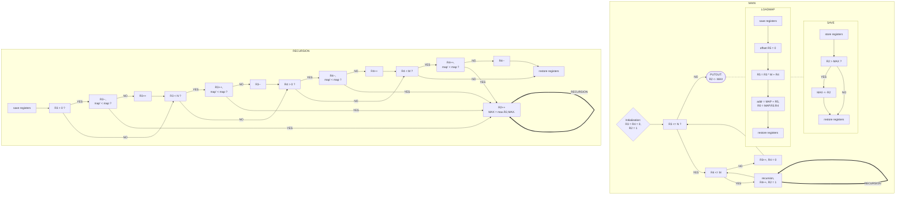

# repo-lab5

## Algorithm (recursion)



## Essential parts of codes

* In order to make each element a starting point, I used a double-layer loop in the main program (posted below) to iterate over each number in a two-dimensional array.

  First, with fixed R3(row), increment R4(column) and each time enter recursion(when return from the recursion, reset the counter R2 to 1, CON part from line 10 to line 14), until R4 is equal to M(line 5).

  When R4 is equal to M, plus one to R3 and clear R4(from line 7 to line 9), then repeat this process, until R3 is equal to N(line 2). Finally, assign MAX to R2 as our output, and over the program.

```assembly
RE1 LD      R5,_N
    ADD     R1,R3,R5    ; R3 - N
    BRz     PUTOUT
RE2 LD      R5,_M
    ADD     R1,R4,R5    ; R4 - M
    BRn     CON
    AND     R4,R4,#0    ; R4 = 0
    ADD     R3,R3,#1    ; R3++
    BR      RE1
CON JSR     RE
    ADD     R4,R4,#1    ; R4++
    AND     R2,R2,#0
    ADD     R2,R2,#1    ; R2 = 1
    BR      RE2
```

* The essential part of my codes is about **recursion**, and to reduce the repetition, I only keep one of the four directions(up and down, left and right) for analysis. The code posted below is also simplified.

  One more thing to note before I analyze the codes is that I use two subroutines in recursion, which are LOADMAP and SAVE.(This is not the core part of the code, so I did not post their code in the report.)

  For LOADMAP, it will make R0 equal to MAP [R3].[R4] (namely the element with row R3 and column R4 in the two-dimensional array MAP).

  And for SAVE, it compares the value of R2 and MAX, then assigns the bigger one to MAX.

  

  Based on the current point, judge whether it can go up, down, left and right in turn (the value in this point is greater than the value in the next point, written as map > map’ in the following report). There are two steps here. The first step is whether there is a way to go(the next point exists), the second step is whether the conditions(map’ < map) are met.

  Here we take direction UP for example. If the first step does not fit, jump to the next direction(line 8, jump to DOWN part starting from line 20). And if the second step doesn’t fit, plus one to R3(line 19, U1 part) before jump to next direction(line 14 and DOWN part). (R3 plus one to keep the current point the same as the base point of recursion at this level, namely the same point when enter UP part.)

  

  If all of two conditions are fit, the program plus one to counter R2(line 15) and enter subroutine SAVE(line 16, to keep the value of MAX biggest in the running process). Then enter recursion(line 17), and take the current point as the base point in recursion at this new level. When return from recursion, recovery R2 and R3(line 18,19) to keep the state the same as in this recursion.

  

  Finally, with all four directions having gone through, restore the registers and quit this recursion(line 28).

```assembly
RE  ; recursion
	...				  ; save registers
    JSR     LOADMAP
    ADD     R1,R0,#0    ; R1 = MAP[R3][R4]
    ;
UP  
    ADD     R3,R3,#0    ; R3 > 0 ?
    BRz     DOWN
    ADD     R3,R3,#-1
    JSR     LOADMAP     ; R0 = MAP'
    NOT     R5,R0
    ADD     R5,R5,#1    ; R5 = - MAP'
    ADD     R5,R1,R5    ; MAP - MAP'
    BRnz    U1
    ADD     R2,R2,#1
    JSR     SAVE
    JSR     RE
    ADD     R2,R2,#-1
U1  ADD     R3,R3,#1
DOWN
   ...
LEFT
   ...
RIGHT
   ...
OVER ; over this recursion
   ...				   ; restore registers
    RET
```


## Q&A

I talked about the idea of writing code, and introduced the the meaning of the registers used in the program and the algorithms used in the code to TA. 

In addition, the TA asked me how I could modify my program to reduce the time it takes to run it. 
I think it is only necessary to set aside another space as large as the array MAP. And after calculating the MAX of a point, store it in the corresponding space of that point. So in the next point which runs through this point, you can directly call the result without running again, which saves a lot time.
