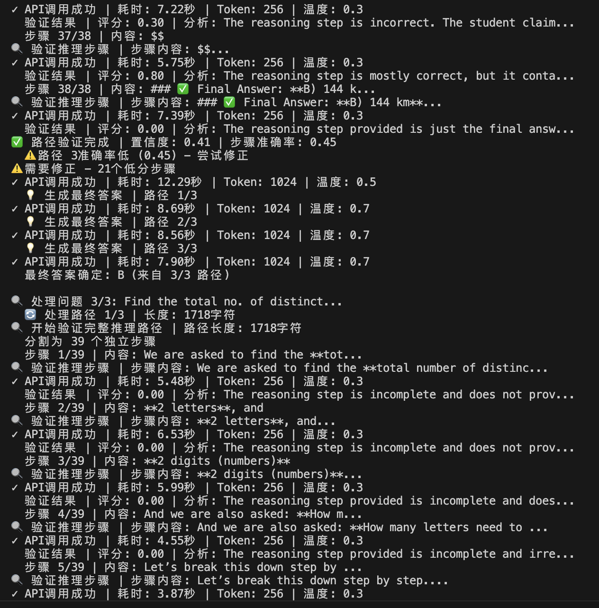

因为对多路径的每条路径都进行了验证，所以调用api量比较大，耗时也比较久，因此验证的时候只选了40个而不是100个（在上一个同学的基础上进行的工作，跑代码的时候文件夹名字还没改过来，还是“多路径”）。

因为跑的时候加入了一些输出来确保程序是运行着的而不是死循环的，输出的内容稍微有点多，只进行了截图而没有及时保存下来（跑完程序后很大一部分输出都被截断了看不到了）：

api调用失败情况的输出：

