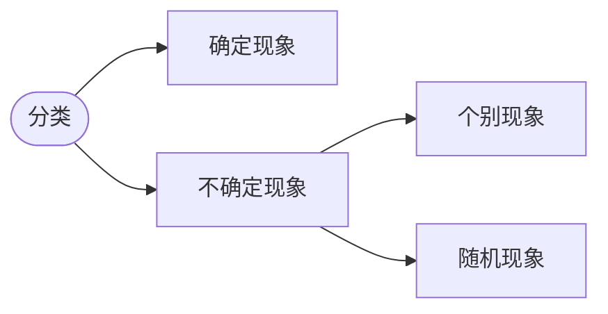

# 概统

> [jyt555/zju_cs: My note warehouse (github.com)](https://github.com/jyt555/zju_cs): `https://github.com/jyt555/zju_cs`

### 成绩组成

* 平时分60
  
  （上交教室作业+到课率 25 + 学在浙大讨论题 5 + 学在浙大三次测验 30）
  
* 期末考试 40（设置最低分）

* 测验初步安排：
  * 1：到第二章，秋7周五 21:30-22:30
  * 2：到第四章，冬3周六
  * 3：到第七章，冬6周五
  
* 内容：第一章到第八章

---

## 概率论的基本概念

### 样本空间，随机事件

概统是研究随机现象数量规律的学科
在个别试验中其结果呈现不确定性，但在大量重复试验中其结果又具有统计规律性

**随机试验**：对随机现象的观察、记录、实验
（可在相同条件下重复进行，事先知道可能出现的结果，事先不知道哪个结果发生）

#### 样本空间

随机试验E的所有结果构成的集合称为E的**样本空间**，记为S，称S中的元素e为**样本点**.

#### 随机事件

称S的子集A为E的**随机事件A**，简称事件A.
当且仅当A所包含的一个样本点发生称事件A发生。

由一个样本点组成的单点集，称为**基本事件**。
每次试验S总是发生，故又称S为**必然事件**。
记**Φ为空集**，不包含任何样本点, 则每次试验Φ都不发生, 称Φ为**不可能事件**。

#### 事件的关系及运算

* A⊂B：（**包含**）A发生一定导致B发生
* A=B：（**相等**）A⊂B且B⊂A

* **和事件**：A∪B 至少有一个发生
* **积事件**：A∩B，A·B，AB 同时发生
* **差事件**：A-B，发生A，不发生B

当AB= Φ时，称事件A与B是互不相容的，或**互斥**的.
当AB= Φ且A∪B=S时，称A，B**互逆**（互为对立事件）（此时B是A的逆事件-A）

* **串联系统**：由n个元件组成的系统，其中一个损坏，则系统损坏
* **并联系统**：一个不损坏则系统不损坏

### 频率与概率

#### 频率

**f~n~(A) = n~A~ / n** 其中n~A~是**频数**（发生次数），n是总试验测试

f~n~(A)随着n的增大渐趋稳定，记稳定值为p

#### 概率

对任意A，**P(A)**满足非负性、规范性（总和为一），可列可加性，则P(A)为事件A的概率

### 等可能概型（古典概型）

S中样本点有限(有限性)
出现每一样本点的概率相等(等可能性)

实际推断原理：概率很小的事件在一次试验中实际上几乎不发生

* `每一样本点等概率，第k次出现某种情况的概率与k无关`

### 条件概率

P(B|A)表示A发生的条件下，B发生的条件概率

P(AB) = P(A)·P(B|A) = P(B)·P(A|B)

#### 全概率公式和Bayes公式

称B~1~, B~2~, … , B~n~ 为S的**一个划分**，若：
不漏 B~1~∪B~2~∪…∪B~n~ = S
不重 B~i~B~j~ = Φ，i ≠ j

**全概率公式:**
$$
P(A)=\sum_{j=1}^nP(B_j)P(A|B_j)
$$

**Bayes公式:**
$$
P(B_i|A)=\frac{P(B_i)P(A|B_i)}{\sum_{j=1}^nP(B_j)P(A|B_j)}
$$

### 事件的独立性

设A，B为两随机事件，如果**P(AB)=P(A)*P(B)**，则称A，B 相互独立。若P(A) ≠ 0，则 P(AB)=P(A)P(B)等价于P(B|A)=P(B).

独立试验：结果不影响其他子试验的结果

重复试验：各子试验在相同条件下进行的

---

## 随机变量及其分布

###  随机变量

设随随机变量的样本空间为S = {e}，若X = X(e)为定义在样本空间S上的实值单值函数，则称X = X(e)为**随机变量**

常见的两类：离散性的 / 连续型的

###  离散型随机变量及其分布

取值至多可数的随机变量为离散型的随机变量 $\sum_{i=1}^\infty p_i=1$

**概率分布律**：写出所有可能取值和对应概率

#### 0-1分布 / 两点分布

**X ~ 0 - 1(p) 或 B(1,p)**
$$
P(X=k)=p^k(1-p)^{1-k},k=0,1.
$$
Bernoulli 试验

#### 二项分布

n重贝努利试验：试验E只有两种可能的结果，A与A‘，相同条件下，将E**独立**地重复n次

**X ~ B(n,p)**
$$
P(X=k)=C_n^k·p^k(1-p)^{n-k},k=0,1,...,n
$$
excel中返回一元二项式分布的概率:`` =BINOM.DIST(10,100,0.05,1/0)``

1: <= 10	0: == 10

#### poisson分布   lambda λ

**X ~ P($\lambda$)**
$$
P(X=k)=\frac{\lambda^ke^{-\lambda}}{k!},k=0,1,...,\lambda>0
$$

> 二项分布与泊松分布有以下近似公式：
> 当n>10, p<0.1时，$C_n^k·p^k(1-p)^{n-k}\approx\frac{\lambda^ke^{-\lambda}}{k!}$ ，
> 其中λ = np

excel：``=POISSON.DIST(2,5,1/0)``

#### 超几何分布

$$
P(X=k)=\frac{C_a^kC_b^{n-k}}{C_N^n},k=l_1,l_1+1,...,l_2\\
l_1=max(0,n-b),l_2=min(a,n).
$$

>一袋中有a个白球，b个红球，**a＋b＝N**,从中**不放回**地取n个球，设每次取到各球的概率相等，以X表示取到的白球数，则X服从超几何分布。

#### 几何分布

$$
P(X=k)=p(1-p)^{k-1},k=1,2,...,0<p<1.
$$

> 从生产线上随机抽产品进行检测，设产品的次品率为p，0<p<1，若**查到一只**次品就得停机检修，设停机时已检测到X只产品，则X服从参数p的几何分布。

#### 巴斯卡分布

$$
P(X=k)=C_{k-1}^{r-1}p^r(1-p)^{k-r}\\k=r,r+1,...,r\in N^+,0<p<1.
$$

> 独立重复地进行试验，每次试验的结果为成功或失败，每次试验中成功的概率均为p，0<p<1,试验进行到出现**r次成功**为止，以X表示试验次数，则X服从参数为(r,p)的巴斯卡分布。

###  随机变量的分布函数

$$
F(x)=P(X\leq x)
$$

* 0 <= F(x) <=1
* F(x)单调不减，且F(-∞) = 0，F(+∞) = 1
* F(x)右连续
* F(x) - F(x - 0) = P(X = x)

一般地，设离散型随机变量X的分布律为$P(X=x_k)=p_k,k=1,2,...$
$F(x)=\sum p_k$ 分布函数在x~k~处有跳跃，跳跃值为$p_k=P\lbrace {X=x_k}\rbrace$

###  连续型随机变量及其密度函数

对于随机变量X的分布函数F(x)，若存在非负的函数f(x)，使对于任意实数x，有$F(x)=\int_{-\infty}^xf(t)dt$，则x称为连续型随机变量

* $f(x)\geq 0$
* $\int_{-\infty}^{+\infty}f(x)dx=1$
* 对于任意 x~2~ > x~1~，$P\lbrace{x_1<X\leq x_2}\rbrace=\int_{x_1}^{x_2}f(t)dt$，则P{X = a} = 0
* 在f(x)的连续点x，F’(x) = f(x)
* $F(x)=P\lbrace{X\leq x}\rbrace=\int_{-\infty}^xf(t)dt$

> 设A，B是随机事件，
> 若P(A) = 1，则A是必然事件吗？:x:
> 若P(B) = 0，则B是不可能事件吗？:x:
> 若P(AB) = 0，则A与B不相容吗？:x:
>
> 连续型r.v.取任一指定值的概率为0，即P(X=a)=0 ，而 {X=a} 并非不可能事件，同理，P(X=B)=1，但{X=B}并非必然事件。几何概型里面，在一个正方形里面取一个点的概率是0（无法计算），但却并非是不可能事件。

**几个重要的连续型随机变量分布：**

#### 均匀分布

**X~U(a,b)**
$$
f(x)=
\begin{cases}
\frac{1}{b-a},\quad x\in(a,b) \\[2ex]
0,\quad others
\end{cases}\\\\
F(x)=\frac{x-a}{b-a},a<x<b.
$$

#### 指数分布(无记忆性)

**X~Exp(λ) 或 X~E(λ)**
$$
f(x)=
\begin{cases}
\lambda e^{-\lambda x},x>0\\[2ex]
0,\quad x\leq 0
\end{cases},\lambda >0\\\\
F(x)=1-e^{-\lambda x},x>0.
$$

#### :star:正态分布(Gauss分布)

**X~N(u,σ^2^)**
$$
f(x)=\frac{1}{\sqrt{2\pi}\sigma}e^{-\frac{(x-\mu)^2}{2\sigma^2}},-\infty\leq x \leq+\infty
$$

* f(x) 关于x = u 对称
* f~max~ = f(u) = $\frac{1}{\sqrt{2\pi}\sigma}$

u是位置参数（决定对称轴位置）
σ是尺度参数（决定曲线分散性）

若 **Z~N(0,1)**，称Z服从**标准正态分布**
$$
Z的概率密度：\varphi(x)=\frac{1}{\sqrt{2\pi}}e^{-\frac{x^2}{2}}\\[2ex]
Z的分布函数：\Phi(x)=\int_{-\infty}^x\frac{1}{\sqrt{2\pi}}e^{-\frac{t^2}{2}}dt.\\[2ex]
\Phi(x)+\Phi(-x)=1
$$
当 X~N($\mu,\sigma^2$)时， $\frac{X-\mu}{\sigma}$~N(0,1)：
$$
P(|X-\mu|<\sigma)=\Phi(1)-\Phi(-1)=2\Phi(1)-1=0.6826\\
P(|X-\mu|<2\sigma)=2\Phi(2)-1=0.9544\\
P(|X-\mu|<2\sigma)=2\Phi(3)-1=0.9974
$$

> 用天平称一实际重量为a的物体，天平的读数为随机变量X，设X~N(a,0.01^2^)时，
> （1）求读数与a的误差小于0.005的概率；
> （2）求读数至少比a多0.0085的概率。

$$
^1\dots P(|X-a|<0.005)=\Phi(\frac{0.005}{0.01})-\Phi(-\frac{0.005}{0.01})\\
=2\Phi(0.5)-1=2*0.6915-1=0.3830\\[2ex]
^2\dots P(X-a\geq 0.0085)=1-\Phi(0.85)=1-0.8023=0.1977
$$

excel：``=NORM.DIST(0.0085, 0, 0.01, 1)``计算P(X-a < 0.0085)

| 离散型                               | 连续型                               |
| ------------------------------------ | ------------------------------------ |
| 两点分布：**X ~ 0 - 1(p) 或 B(1,p)** | 均匀分布：**X~U(a,b)**               |
| 二项分布：**X ~ B(n,p)**             | 指数分布：**X~Exp(λ) 或 E(λ)**       |
| 泊松分布：**X ~ P($\lambda$)**       | 正态分布(Gauss分布)：**X~N(u,σ^2^)** |
| 超几何分布                           | 标准正态分布： **Z~N(0,1)**          |
| 几何分布                             |                                      |
| 巴斯卡分布                           |                                      |

###  随机变量函数的分布

> 已知随机变量X的概率分布，且已知Y=g(X)，求Y的概率分布

$$
^1\dots 若Y为离散量，则先写出Y的可能取值，\\
再找出(Y=y_j)的等价事件(X\in D)，\\
得P(Y=y_j)=P(X\in D)\\
^2\dots 若Y为连续量，则先写出Y的概率分布函数F_Y(y)=P(Y\leq y)，\\
找出(Y\leq y)的等价事件(X\in D)，得F_Y(y)=P(X\in D)，\\
再找出Y的概率密度函数f_Y(y).\\[2ex]
常用到复合函数求导：\frac{d(F_x(h(y)))}{dy}=f_x(h(y))h'(y).
$$

$$
设随机变量X具有密度函数f_X(x)，\\
分别求Y=|X|，Z=X^2的概率密度函数：\\[2ex]
f_Y(y)=
\begin{cases}
f_X(y)+f_X(-y),\quad y>0\\
0,\quad y\leq 0
\end{cases}\\[2ex]
f_Z(z)=
\begin{cases}
\frac{1}{2\sqrt z}[f_X(\sqrt z)+f_X(-\sqrt z)],\quad z>0\\
0,\quad z\leq 0
\end{cases}
$$

$$
》\quad Z服从自由度为1的\chi^2分布:f_Z(z)=
\begin{cases}
\frac{1}{\sqrt{2\pi}}z^{-0.5}e^{-0.5z},\quad z>0\\[2ex]
0,\quad z\leq 0
\end{cases}
$$

**定理**：设$X\sim f_X(x)$，$g'(x)>0（或g'(x)<0）,Y=g(X),则Y具有的概率密度函数为:$
$$
f_Y(y)=
\begin{cases}
f_X(h(y))·|h'(y)|,\quad \alpha <y<\beta\\[2ex]
0,\quad其他
\end{cases}\\[2ex]
这里(\alpha,\beta)是Y的取值范围，h是g的反函数。
$$
若$X\sim N(\mu,\sigma^2),Y=aX+b\Longrightarrow Y\sim N(a\mu+b,a^2\sigma^2)$

---

## 多元随机变量及其分布

###  二元离散型随机变量

设E是一个随机试验，样本空间S={e}；设X=X(e)和Y=Y(e)是定义在S上的随机变量，由它们构成的向量(X,Y)叫做**二元随机变量**或**二维随机变量**

**离散型随机变量**：若二元随机变量(X,Y)全部可能取到的不同值是有限对或可列无限对，则称(X, Y)是离散型随机变量。

#### 联合概率分布

离散型随机变量的**联合概率分布律**：
P(X = x~i~, Y = y~j~) = p~ij~, i, j = 1, 2,…

性质：大于等于零，和为一

#### 边际分布

离散型随机变量的**边际分布律**为：$P(Y=y_i)=P(X<+\infty,Y=y_j)=\sum _{i=1}^\infty p_{ij}\;^{记为}\;p_{·j}\quad j=1,2,\cdots$

#### 条件分布

对于两个事件A, B，若P(A) > 0，考虑条件概率P(B|A)

对于二元离散型随机变量(X,Y)，设其分布律为P(X = x~i~, Y = y~j~) = p~ij~, i, j = 1, 2,…
若P(Y = y~j~) = p~·j~ > 0, 考虑条件概率 P(X = x~i~ | Y = y~j~)

由条件概率公式可得：$P(X = x_i | Y = y_j) = \frac{p_{ij}}{p_{·j}}$，为在{Y = y~j~}条件下，随机变量X的条件分布律

### 二元随机变量的分布函数

#### 联合分布函数

设(X, Y)是二元随机变量，对于任意实数x, y，二元函数F(x, y) = P{X $\leq$ x, Y $\leq$ y}称为二元随机变量的**联合分布函数**

性质：关于x,y单调不减，零到一

#### 边际分布函数

F~X~(x) = F(x, +$\infty$)

F~Y~(y) = F(y, +$\infty$)

#### 条件分布函数

若P(Y = y) > 0，则在{Y = y}条件下，X的条件分布函数为：
$$
F_{X|Y}(x|y)=P(X\leq x|Y=y)=\frac{P(X\leq x,Y=y)}{P(Y=y)}
$$

若P(Y = y) = 0，但对任意$\varepsilon > 0,P(y<Y\leq y+\varepsilon)>0$，则在{Y = y}条件下，X的条件分布函数为：
$$
F_{X|Y}(x|y)=\lim_{\varepsilon \rightarrow 0^+}\frac{P(X \leq x,y<Y\leq y+\varepsilon)}{P(y<Y\leq y+\varepsilon)},仍记P(X\leq x|Y=y)
$$

### 二元连续型随机变量

#### 联合概率密度函数

对于二元随机变量(X, Y)的分布函数F(x, y)，如果存在非负函数f(x, y)，使对于任意x, y，有$F(x,y)=\int_{-\infty}^y\int_{-\infty}^xf(u,v)dudv$，称(X, Y)为**二元连续型随机变量**，称F(x, y)为其**（联合）概率密度函数**

性质：大于等于零，积分为一
$$
设二元随机变量(X,Y)的概率密度函数\\
f(x,y)=
\begin{cases}
ke^{-(2x+3y)},\quad x>0,y>0\\
0,\quad 其他
\end{cases}\\[2ex]
(1)求常数k；
(2)求联合分布函数F(x,y);
(3)求P(Y\leq X)
$$
P(X > 0.5, Y ≤ 0.5) ≠ P(X > 0.5)P(Y ≤ 0.5)

#### 边际概率密度函数

设连续型随机变量(X,Y)的密度函数为f(x,y)，则X,Y的边际概率密度函数分别为
$$
f_X(x)=\int_{-\infty}^{+\infty}f(x,y)dy\\[2ex]
f_Y(y)=\int_{-\infty}^{+\infty}f(x,y)dx
$$

#### 条件概率密度函数

设二元随机变量(X,Y)的密度函数为f(x,y)，X,Y的边际密度函数为f~X~(x), f~Y~(y)，则在{Y = y}条件下X的条件密度函数为（x同理）：
$$
f_{X|Y}(x|y)=\frac{f(x,y)}{f_Y(y)},f_Y(y)>0
$$
性质：大于等于零，积分为一等

#### 二元均匀分布与二元正态分布

**二元均匀分布：**
$$
f(x,y)=
\begin{cases}
\frac{1}{D的面积}，\quad (x,y)\in D\\[2ex]
0,\quad 其他
\end{cases}
$$
二元均匀分布的条件分布仍是均匀分布

**二元正态分布：**
$$
f(x,y)=\frac{1}{2\pi \sigma_1\sigma_2\sqrt{1-\rho^2}}\\
\times exp\;\Bigg[{ \frac{-1}{2(1-\rho^2)}\bigg(\frac{(x-\mu_1)^2}{\sigma_1^2}-2\rho\frac{(x-\mu_1)(y-\mu_2)}{\sigma_1\sigma_2}+\frac{(y-\mu_2)^2}{\sigma_2^2} \bigg) }\Bigg]\\
-\infty<x<+\infty,-\infty<y<+\infty\\
\sigma_1>0,\sigma_2>0,-1<\rho<1
$$
(X, Y) ~ N($\mu_1,\;\mu_2,\;\sigma_1^2, \;\sigma_2^2,\;\rho$)

则：X ~ N($\mu_1,\;\sigma_1^2$)，Y ~ N($\mu_2,\;\sigma_2^2$)

:pushpin:相互独立的条件（充要）：$\rho=0$

### 随机变量的独立性

F(x, y) = F~X~(x)F~Y~(y)

离散型：p~ij~ = p~i·~ p~·j~

连续型：f(x,y) = f~X~(x) f~Y~(y)
$$
F(x_1,x_2,\cdots x_n)=\Pi \;F_{X_i}(x_i),则称X相互独立\\
F(x_m,\cdots,y_n,\cdots)=F_1(x_m,\cdots)F_2(y_n,\cdots)同理，且X和Y相互独立
$$

### :star:二元随机变量的函数分布

找到新的取值范围

#### Z = X + Y (备用)

> X~P($\lambda_1$)  Y~P($\lambda_2$)，且独立， 则Z~P($\lambda_1+\lambda_2$)

* 离散型：P(Z=z~k~) = P(X+Y=Z~k~) = $\sum$ P(X=x~i~,Y=z~k~-x~i~)

* 连续型： $F_Z(z)=P(Z\leq z)= \int_{-\infty}^zf_Z(u)du$
  $f_Z(z)=\int_{-\infty}^{+\infty}f(z-y,y)dy$
  xy相互独立：$f_Z(z)=\int_{-\infty}^{+\infty}f_X(z-y)f_Y(y)dy$ ，卷积公式

#### M = max{X, Y} (并联)

$$
F_{max}(z)=F_X(z)F_Y(z)
$$

#### N = min{X, Y} (串联)

$$
F_{min}(z)=1-(1-F_X(z))(1-F_Y(z))
$$

---

## 随机变量的数字特征

> 不考：条件数学期望、协方差矩阵

### 数学期望

#### 数学期望定义

$$
期望/数学期望/均值：所有可能取值的加权平均\\
离散型：E(X)=\sum_{k=1}^{+\infty}x_kp_k\\
连续型：E(X)=\int_{-\infty}^{+\infty}xf(x)dx\quad (condition:\int_{-\infty}^{+\infty}|x|f(x)dx<\infty)
$$

| 离散型                   | 连续型                             |
| ------------------------ | ---------------------------------- |
| 两点分布：$E(X)=p$       | 均匀分布：$E(X)=\frac{a+b}{2}$     |
| 二项分布：$E(X)=np$      | 指数分布：$E(X)=\frac{1}{\lambda}$ |
| 泊松分布：$E(X)=\lambda$ | 正态分布：$E(X)=\mu$               |

二元随机变量：
$$
离散型：E(Z)=E[h(X,Y)]=\sum_{i=1}^\infty \sum_{j=1}^\infty h(x_i,y_j)p_{ij}\\
连续型：E(Z)=E[h(X,Y)]=\int_{-\infty}^{+\infty} \int_{-\infty}^{+\infty} h(x,y)f(x,y)dxdy
$$

#### 随机变量函数的数学期望

$$
设Y=g(X)\;(连续函数):函数值的加权平均\\
X离散型：E(Y)=E(g(X))=\sum_{k=1}^\infty g(x_k)p_k\\
X连续型：E(Y)=E(g(X))=\int_{-\infty}^{+\infty}g(x)f(x)dx
$$

#### 数学期望的性质

$E(aX+bY+c)=aE(X)+bE(Y)+c$

:pushpin:独立变量时：$E(XY)=E(X)E(Y)$, 可推广到任意有限个相互独立的随机变量

`最大最小的期望相加=和的期望=期望的和`

> 例：一专用电梯载着12位乘客从一层上升，最高11层.假设中途没有乘客进入，每位乘客独立等概率地到达各层.如果没有乘客到达某层楼，电梯在该层就不停.记电梯停留次数为X，求E(X).
> (设电梯到达11层后乘客全部下完)

$$
引入随机变量：X_i=
\begin{cases}
0,\;第i层没有人到达\\
1,\;第i层有人到达
\end{cases}
\quad i=2,3,\cdots,11,\\

X=X_2+X_3+\cdots+X_{11}\\
E(X_i)=P(X_i=1)=1-(0.9)^{12}\\
E(X)=E(X_2)+\cdots+E(X_{11})=10\times E(X_i)=7.176
$$

### 方差

#### 方差的定义

若E{[X-E(X)]^2^}存在，称其为X的方差（衡量取值的分散程度-方差小则集中）
$$
方差：Var(X)\;or\;D(X)=E\Big[ [X-E(X)]^2 \Big]\\
标准差/均方差：\sigma(X)=\sqrt{Var(X)}\\[3ex]
离散型：Var(X)=\sum_{i=1}^\infty[x_i-E(X)]^2p_i\\
连续型：Var(X)=\int_{-\infty}^{+\infty}[x-E(X)]^2f(x)dx\\
Var(X)=E(X^2)-[E(X)]^2
$$

| 离散型                        | 连续型                               |
| ----------------------------- | ------------------------------------ |
| 两点分布：$D(X)=p(1-p)$       | 均匀分布：$D(X)=\frac{(b-a)^2}{12}$  |
| 二项分布：$D(X)=np(1-p)$      | 指数分布：$D(X)=\frac{1}{\lambda^2}$ |
| 泊松分布：$D(X)=\lambda=E(X)$ | 正态分布：$D(X)=\sigma^2$            |

#### 方差的性质

* 设C是常数，Var(C) = 0
* Var(CX) = C^2^Var(X)
* Var(X+Y) = Var(X) + Var(Y) +2E{ [X-E(X)]·[Y-E(Y)] }
* :pushpin:若X和Y相互独立，Var(X+Y) = Var(X) + Var(Y)

$$
Var(aX+bY+c)=a^2Var(X)+b^2Var(Y),\;X与Y相互独立
$$

* $Var(X)=0\Leftrightarrow P(X=C)=1,且C=E(X)$

$$
若X_i\sim N(\mu,\sigma_i^2)\;i=1,2,\cdots,n且它们相互独立，则：\\
C_0+C_1X_1+C_2X_2+\cdots+C_nX_n\\
\sim N(C_0+C_1\mu_1+C_2\mu_2+\cdots+C_n\mu_n\;,C_1^2\sigma_1^2+C_2^2\sigma^2_2+\cdots+C_n^2\sigma^2_n)\\
C_1,C_2,\cdots,C_n是不全为零的常数
$$

> 例：设X~N(22.40, 0.03^2^), Y~N(22.50, 0.04^2^)，且X和Y:pushpin:相互独立，计算P(X<Y).

$$
X-Y\sim N(-0.10,\; 0.05^2)\\
P(X<Y)=P(X-Y<0)=\Phi(\frac{0-(-0.10)}{0.05})=\Phi(2)=0.9772
$$

$$
》设随机变量X具有数学期望E(X)=\mu,方差Var(X)=\sigma^2\neq 0\\
记X^*=\frac{X-\mu}{\sigma},称为X的标准化变量\\
E(X^*)=0,\; Var(X^*)=1,\;且X^*无量纲
$$

### 协方差与相关系数

$$
X与Y的协方差：Cov(X,Y)=E\Big[\; [X-E(X)][Y-E(Y)] \;\Big]\\
计算公式：Cov(X,Y)=E(XY)-E(X)E(Y)\\
性质补充：Var(X+Y)=Var(X)+Var(Y)+2Cov(X,Y)
$$

* Cov(X, Y) = Cov(Y, X)
* Cov(X, X) = Var(X)
* Cov(aX, bY) = ab·Cov(X,Y)
* Cov(X~1~ + X~2~, Y) = Cov(X~1~, Y) + Cov(X~2~, Y)
* Var(X)Var(Y) $\neq$ 0时，有(Cov(X, Y) )^2^ $\leq$ Var(X)Var(Y)，等号当且仅当$\exist a,b,\;P(Y=a+bX)=1$

$$
X与Y的相关系数(无量纲)：\rho_{XY}=\frac{Cov(X,Y)}{\sqrt{Var(X)Var(Y)}}=\frac{Cov(X,Y)}{\sigma(X)\sigma(Y)} \\[2ex]
\rho_{XY}=Cov\Big[ \frac{X-E(X)}{\sqrt{Var(X)}},\; \frac{Y-E(Y)}{\sqrt{Var(Y)}} \Big]
$$

* $|\rho_{XY}|\leq 1$

* $|\rho_{XY}|= 1\Leftrightarrow \exist a,b,P(Y=a+bY)=1$ 且$\rho_{XY}= 1\Rightarrow b>0$ ; $\rho_{XY}=- 1 \Rightarrow b<0$

$$
考虑以X的线性函数a+bX来近似表示Y\\
以均方误差e(a,b)=E\Big[\; [Y-(a+bX)]^2 \;\Big]来衡量近似表示Y的好坏程度\\
e(a,b)越小，近似程度越好\\[2ex]
当e(a_0,b_0)=\min e(a,b)时，有：\\
\begin{cases}
a_0=E(Y)-b_0E(X)\\[2ex]
b_0=\frac{Cov(X,Y)}{Var(X)}=\rho_{XY}\frac{\sigma(Y)}{\sigma(X)}
\end{cases} \\
此时e(a_0,b_0)=(1-\rho^2_{XY})Var(Y)
$$

* $\rho_{XY}>0,Cov(X,Y)>0,b_0>0$，反之同理

| :star2:相关系数$\rho_{XY}$ | 线性关系紧密程度    |
| -------------------------- | ------------------- |
| $|\rho_{XY}|$较大          | 线性关系程度好      |
| $|\rho_{XY}|$较小          | 线性关系程度差      |
| $|\rho_{XY}|=1$            | 以概率1存在线性关系 |
| $\rho_{XY}>0$              | 正相关              |
| $\rho_{XY}<0$              | 负相关              |
| $\rho_{XY}=0$              | 不相关/零相关       |

$\rho_{XY}=0$称:pushpin:X与Y**不相关或零相关**

$\Leftrightarrow Cov(X,Y)=0$

$\Leftrightarrow E(XY)=E(X)E(Y)$

$\Leftrightarrow Var(X+Y)=Var(X)+Var(Y)$

:pushpin:`独立是没有函数关系，一定不相关；不相关只是没有线性关系，不一定独立`

:pushpin:二元正态变量(X,Y)的概率密度中，参数$\rho$就是X,Y的相关系数：
X和Y独立 $\Leftrightarrow \rho=0 \Leftrightarrow$ X和Y不相关

> 有n包巧克力，每包重量服从分布$N(\mu,\sigma^2)$，且各包重量相互独立，求前k（$1\leq k\le n$）包重量与这n包总重量的相关系数

$$
X_i\sim N(\mu,\sigma^2)\\
S_k=X_1+X_2+\cdots+X_k \sim N(k\mu,k\sigma^2)\\
>wrong:S_k=kX \sim N(k\mu,k^2\sigma^2) <\\
Cov(S_k,S_n)=Cov(S_k,S_k+X_{k+1}+\cdots+X_n)=Var(S_k)=k\sigma^2 \\
\rho_{S_k,S_n}=\frac{Cov()}{\sigma_{S_k}\sigma_{S_n}}=\sqrt{\frac kn}
$$

### 其他数字特征

若 E(X^k^) 存在：**k阶（原点）矩**

若 E{ [X-E(X)]^k^ } 存在：**k阶中心矩**

若 E{ X^k^Y^l^ } 存在：**k+l阶混合（原点）矩**

若 E{ [X-E(X)]^k^[Y-E(Y)]^l^ } 存在：**k+l阶混合中心矩**

**上（侧）α分位数**：满足$P(X>x_\alpha)=1-F(x_\alpha)=\int_{x_\alpha}^{+\infty}f(x)dx=\alpha$ 的实数$x_\alpha$

标准正态分布：$Z_{1/2}=0,\;Z_{1-\alpha}=-Z_\alpha$

* excel中`NORM.S.INV`用于查询标准正态分布的分位数

### 多元随机变量的数字特征

$$
设n元随机变量X=(X_1,X_2,\cdots,X_n)^T，若每一分量数学期望都存在\\
称\;E(X)=(\; E(X_1),E(X_2),\cdots,E(X_n) \;)^T\;为数学期望（向量）\\
\\
(X_1,X_2)的协方差矩阵：\left[
\begin{matrix}
Var(X_1) & Cov(X_1,X_2)\\
Cov(X_2,X_1) & Var(X_2)
\end{matrix}
\right]
$$

（:x:不考）协方差矩阵是一个对称的非负定矩阵

`利用协方差矩阵，可由二元正态变量的概率密度推广，得到n元正态变量的概率密度`

下述不用记，只需知道n元正态分布是由a和B决定：

> 已知$(X_1,X_2)\sim N(\mu_1,\mu_2,\sigma_1^2,\sigma_2^2,\rho)$
> $$
> 协方差矩阵：C=
> \left[
> \begin{matrix}
> \sigma^2_1 & \rho\sigma_1\sigma_2\\
> \rho\sigma_1\sigma_2 & \sigma_2^2
> \end{matrix}
> \right]\\[2ex]
> 行列式|C|=\sigma_1^2\sigma_2^2(1-\rho^2)\\[2ex]
> 逆矩阵：C^{-1}=\frac{1}{|C|}
> \left[
> \begin{matrix}
> \sigma_2^2 & -\rho\sigma_1\sigma_2\\
> -\rho\sigma_1\sigma_2 & \sigma_1^2
> \end{matrix}
> \right]\\[2ex]
> =\frac{1}{1-\rho^2}
> \left[
> \begin{matrix}
> \frac{1}{\sigma_1^2} & -\frac{\rho}{\sigma_1\sigma_2}\\
> -\frac{\rho}{\sigma_1\sigma_2} & \frac{1}{\sigma_2^2}
> \end{matrix}
> \right]\\[2ex]
> 经计算，(X-\mu)^TC^{-1}(X-\mu)=\dots\\[2ex]
> 推广：f(x_1,x_2,\cdots,x_n)=\frac{1}{(2\pi)^{n/2}|B|^{1/2}}exp\left[ -\frac{1}{2}(X-a)^TB^{-1}(X-a) \right]\\
> B是协方差矩阵，a是均值向量
> $$
> * `n元正态变量的任意子向量都服从k元正态分布；但是正态变量不一定是联合正态分布（若相互独立，则是）`
> * `n元正态分布`$\Leftrightarrow$`正态变量的任意线性组合服从一元正态分布`
> * `正态变量的线性变换不变性：X是n元正态，Y是X线性函数，则Y是k元正态分布`
> * `X是n元正态`$\Leftrightarrow$:pushpin:`X相互独立`$\Leftrightarrow$`X两两不相关`$\Leftrightarrow$`协方差矩阵是对角矩阵`
>
> ---
>
## 大数定律和中心极限定理

> 不考：马尔可夫不等式、李雅普诺夫中心极限定理

### 大数定律

#### 依概率收敛

$$
\forall\epsilon>0,\lim_{n\rightarrow+\infty}P(|Y_n-c|\ge\epsilon)=0\\
则称\{ Y_n,n\ge 1 \}依概率收敛于常数c，记为：\\
Y_n\;\underrightarrow {P\;}\; c，当n\rightarrow +\infty时\\
若X_n\;\underrightarrow {P\;}\; a，Y_n\;\underrightarrow {P\;}\; b，g在(a,b)连续，则g(X_n,Y_n)\;\underrightarrow {P\;}\; g(a,b)
$$

#### 马尔可夫不等式（:x:不考）和切比雪夫不等式

$$
马尔可夫不等式：设随机变量Y的k阶矩存在(k\geq 1),\\
则对任意\varepsilon>0，都有：P[|Y|\geq\varepsilon]\leq \frac{E(|Y|^k)}{\varepsilon^k}成立\\[2ex]
切比雪夫不等式：设X的方差Var(X)存在，\\
则对任意\varepsilon>0,都有：
P[|X-E(X)|\geq\varepsilon]\leq \frac{Var(X)}{\varepsilon^2}成立\\
(Y=X-EX,k=2可推导)
$$

> 例：在n重贝努里试验中，若已知每次试验事件A出现的概率为0.75，试利用切比雪夫不等式计算,
> (1)若n=7500,估计A出现的频率在0.74至0.76之间的概率至少有多大；
> (2)估计n,使A出现的频率在0.74至0.76之间的概率不小于0.90。

$$
\begin{aligned}
\text{解:}& \text{设在}n\text{重贝努里试验中,事件}A\text{出现的次数为}X,  \\
&\text{则}X\thicksim B\left(n,0.75\right),E\left(X\right)=np=0.75n,Var\left(X\right)=npq=0.1875n, \\
&\text{又 }f_n\left(A\right)=\frac{X}{n},P\Big\{0.74<\frac{X}{n}<0.76\Big\}=P\big\{0.74n<X<0.76n\big\} \\
&=P\left\{\left|X-0.75n\right|<0.01n\right\} \\
&\begin{aligned}\geq1-\frac{0.1875n}{\left(0.01n\right)^2}&=1-\frac{1875}n\end{aligned} \\
&(1)n=7500,P\Big\{0.74<\frac{X}{n}<0.76\Big\}\ge1-\frac{1875}{7500}=0.75 \\
&\begin{aligned}(2)P\left\{0.74<\frac{X}{n}<0.76\right\}\ge1-\frac{1875}{n}\ge0.90\quad\implies n\ge18750.\end{aligned}
\end{aligned}
$$

#### 几个大数定律

##### (弱)大数定律：

$$
设Y_1,\cdots,Y_n,\cdots 为一个随机变量序列，若存在常数序列c_n,\\
当n\rightarrow +\infty,\frac{1}{n}\sum_{i=1}^nY_i-c_n\;\; \underrightarrow P \;\;_0\\
$$

##### 切比雪夫大数定律

$$
设X_1,X_2,\cdots,X_n\cdots相互独立，有相同的期望和方差\\
当n\rightarrow + \infty时，\frac{1}{n}\sum_{k=1}^nX_k\;\;\underrightarrow P\;\;\mu
$$

##### 辛钦大数定律

$$
设X_1,X_2,\cdots,X_n\cdots独立同分布，EX_i=\mu\\
当n\rightarrow + \infty时，\frac{1}{n}\sum_{k=1}^nX_k\;\;\underrightarrow P\;\;\mu
$$

##### 贝努利大数定律

$$
设n_A为n重贝努利试验中A发生次数，并记A发生概率p\\
则：\frac{n_A}{n}\;\;\underrightarrow P\;\;p，当n\rightarrow+\infty
$$

### 中心极限定理

#### :star:独立同分布的中心极限定理

$$
设X_1,X_2,\cdots,X_n\cdots独立同分布,E(X_i)=\mu,Var(X_i)=\sigma^2\\
任意实数x,\lim_{n\rightarrow\infty}P\left( \frac{\sum_{i=1}^nX_i-n\mu}{\sqrt n\sigma}\leq x \right)
=\int_{-\infty}^x\frac{1}{\sqrt {2\pi}}e^{-t^2/2}dt=\Phi(x)\\[2ex]
n充分大时，\sum_{i=1}^nX_i\sim N(n\mu,n\sigma^2)\\
\frac{1}{n}\sum_{i=1}^nX_i\sim N(\mu,\frac{\sigma^2}{n})
$$

#### 推论(棣莫弗一拉普拉斯中心极限定理):

设$n_{A}$为$n$重贝努里试验中$A$发生的次数， $P(A)=p\big(0<p<1\big)$,则对任何实数$x$, 有：
$$
\lim_{n\to+\infty}P\left(\frac{n_A-np}{\sqrt{np(1-p)}}\leq x\right)=\int_{-\infty}^x\frac1{\sqrt{2\pi}}e^{-\frac{t^2}2}dt=\Phi(x).\\[2ex]
即：B(n,p)\sim N(np,np(1-p))，当n充分大时
$$
---

## 样本及抽样分布

> 不考：附录

### 总体与样本

* 总体：研究对象的全体 X或F(X)
* 个体：总体中的成员 X~i~
* 总体的容量：总体中包含的个体数
* 有限总体 / 无限总体

* 简单随机样本：代表性（X~i~与X同分布），独立性
* 样本观察值（样本值）：对样本进行观察得到的实际数值x~i~

### 统计量与常用统计量

* 统计量：样本的不含任何未知参数的函数 g(X~1~,X~2~,…,X~n~)

  * 样本均值 $\overline X=\frac{1}{n}\sum_{i=1}^nX_i$ 
    `用样本均值估计总体均值，可能估计过高，也可能过低`
    `所有样本均值的平均值恰好是总体均值（无偏）`
  * 样本方差 $S^2=\frac{1}{n-1}\sum_{i=1}^n(X_i-\overline X)^2$ （1/n: 样本二阶中心矩）
  * 样本标准差 $S=\sqrt{S^2}$

  * 样本矩： k阶矩 $A_k=\frac{1}{n}\sum_{i=1}^nX^k_i$ ；k阶中心矩 $B_k=\frac{1}{n}\sum_{i=1}^n(X_i-\overline X)^k$

当总体数字特征未知时:

* 用样本均值$\bar{X}$估计总体均值$\mu=E(X)$
* 用样本方差$S^2$估计总体方差$\sigma^2=E(X-\mu)^2$
* 用样本原点矩$A_k$估计总体原点矩$\mu_k=E(X^k)$
* 用样本中心矩$B_k$估计总体中心矩$\nu_k=E(X-\mu)^k$

总体方差$\sigma^{2}$的估计可以用$S^2$,也可以用$B_{2}$
$$
S^2=\frac1{n-1}\sum_{i=1}^n{(X_i-\overline{X})^2},\quad B_2=\frac{1}{{n}}\sum_{i=1}^n{(X_i-\overline{X})^2}
$$
当 $\sigma^2>0$时，$E(S^2){=\sigma^2},E(B_2){\neq\sigma^2}$,

:star2:所以$S^2$是$\sigma^2$的无偏估计，而$B_{2}$是有偏估计

### $\chi^2$分布

$$
设随机变量X_1,X_2,\cdots,X_n相互独立，都服从N(0,1)\\
则称\chi^2_n=\sum_{i=1}^nX_i^2服从自由度为n的\chi^2分布，记为\chi^2\sim\chi^2(n)\\
$$

* $设\chi^2\sim\chi^2(n),则E(\chi^2)=n,D(\chi^2)=2n$
* $\chi^2分布的可加性：Y_1,Y_2相互独立，则Y_1+Y_2\sim \chi^2(n_1+n_2)$
* $X\sim N(0,1)\Rightarrow X^2\sim \chi^2(1)$

上$\alpha$分位数：$\chi^2_\alpha(n)$

### t分布

$$
设X\sim N(0,1),Y\sim \chi^2(n),且X和Y相互独立，则\\
T=\frac{X}{\sqrt{Y/n}}服从自由度为n的t分布，记为T\sim t(n)
$$

上$\alpha$分位数：$t_{1-\alpha}(n)=-t_\alpha(n)$

### F分布

$$
设X\sim \chi^2(n_1),Y\sim \chi^2(n_2),且X和Y独立，则\\
F=\frac{X/n_1}{Y/n_2}服从自由度为(n_1,n_2)的F分布，记为F\sim F(n_1,n_2)\\
其中n_1为第一自由度，n_2为第二自由度
$$

* $若F\sim F(n_1,n_2),则\frac{1}{F}\sim F(n_2,n_1)$

* $t\sim t(n),则t^2\sim F(1,n)$

上$\alpha$分位数：$F_\alpha(n_2,n_1)=\frac{1}{F_{1-\alpha}(n_1,n_2)}$
$$
\begin{aligned}
&\textbf{例: }X,Y,Z\textbf{相互独立,均服从}N(0,1),\text{ 则} \\
&(1)X^2+Y^2+Z^2\sim\chi^2(3); \\
&(2)\frac X{\sqrt{(Y^2+Z^2)/2}}\sim t(2); \\
&(3)\frac{2X^2}{Y^2+Z^2}\sim F(1,2). 
\end{aligned}
$$

（图源：`BV168411Z7pf`）

### :star:单个正态总体的抽样分布

$$
设总体X\sim N(\mu,\sigma^2),X_1,X_2,\cdots,X_n是样本，\\
样本均值\overline X\sim N(\mu,\frac{\sigma^2}{n});\;\frac{(n-1)S^2}{\sigma^2}\sim \chi^2(n-1)且\overline X与S^2相互独立\\[2ex]

\frac{\overline X-\mu}{\sigma/\sqrt n}\sim N(0,1),\quad
\frac{\overline X-\mu}{S/\sqrt n}\sim t(n-1)
$$

* $设总体X\sim N(\mu,\sigma^2),X_1,X_2,\cdots,X_n是样本$
  * $\frac{\sum_{i=1}^n(X_i-\overline X)^2}{\sigma^2}\sim\chi^2(n-1)$
  * $\frac{\sum_{i=1}^n(X_i-\mu)^2}{\sigma^2}\sim\chi^2(n)$

> :cat:设总体$X$的均值$\mu$,方差$\sigma^2$存在。$\left(X_1,\cdots,X_n\right)$是取自总体$X$的样本， $\overline{X},S^2$为样本均值和样本方差。
> $(1)\text{ 求}E(S^2);$
> $\begin{aligned}(2)\end{aligned}$若$X\thicksim N\big(\mu,\sigma^2\big)$,求$D(S^2\big)~.$

$$
\begin{aligned}
\begin{aligned}\sum_{i=1}^n(X_i-\bar{X})^2\end{aligned}& \begin{aligned}&=\sum_{i=1}^n(X_i^2-2\bar{X}X_i+\bar{X}^2)\\&=\sum_{i=1}^nX_i^2-2\bar{X}\sum_{i=1}^nX_i+n\bar{X}\end{aligned} &   \\
&=\sum_{i=1}^nX_i^2-2\overline{X}n\overline{X}+n\overline{X}^2 \\
&=\sum_{i=1}^nX_i^2-n\overline{X}^2
\end{aligned}\\
E(S^2)=\sigma^2 \;无偏
$$

$$
\begin{aligned}
&\text{因为总体}X\sim N{\left(\mu,\sigma^2\right)},\text{所以}\frac{(n-1)S^2}{\sigma^2}{\sim}\chi^2(n-1), \\
&\Rightarrow D{\left[\frac{(n-1)S^2}{\sigma^2}\right]}=2(n-1) \\
&\Rightarrow D(S^2)=\frac{2\sigma^4}{n-1}. \\
&\text{随样本量}n\text{增大,}D(S^2)\text{减小}.
\end{aligned}
$$

### :star:两个正态总体的抽样分布

设样本$(X_1,\cdots,X_{n1})$和$(Y_1,\cdots,Y_{n2})$分别来自总体$N(\mu_1,\sigma_1^2)$和$N(\mu_2,\sigma_2^2)$，并且它们相互独立，样本均值分别为$\overline X,\overline Y$，样本方差分别为$S_1^2,S_2^2$，则可以得到下面三个抽样分布
$$
(1)\quad F={\frac{S_1^2/\sigma_1^2}{S_2^2/\sigma_2^2}}={\frac{S_1^2}{S_2^2}}{\left/\frac{\sigma_1^2}{\sigma_2^2}\right.}\sim F(n_1-1,n_2-1).
$$

$$
(2)\quad{\frac{\left(\overline{X}-\overline{Y}\right)-\left(\mu_1-\mu_2\right)}{\sqrt{\frac{\sigma_1^2}{n_1}+\frac{\sigma_2^2}{n_2}}}}\sim N(0,1)
$$

$$
\begin{aligned}
&\text{(3)  当}\sigma_1^2=\sigma_2^2=\sigma^2\text{时,} \\[2ex]
&\begin{aligned}\frac{\left(\overline{X}-\overline{Y}\right)-\left(\mu_1-\mu_2\right)}{S_w\sqrt{\frac{1}{n_1}+\frac{1}{n_2}}}&\sim t\left(n_1+n_2-2\right)\end{aligned} \\[2ex]
&\begin{aligned}\textbf{其中}S_w^2=\frac{\left(n_1-1\right)S_1^2+\left(n_2-1\right)S_2^2}{n_1+n_2-2},S_w=\sqrt{S_w^2}\end{aligned}
\end{aligned}
$$

$$
E(S_1^2)=\sigma^2\;无偏，D(S_1^2)=\frac{2\sigma^4}{n_1-1}，\quad S_2^2\;同理\\
E(S_w^2)=\sigma^2\;无偏，D(S_w^2)=\frac{2\sigma^4}{n_1+n_2-2}比D(S_1^2)更小
$$

> 设总体$X\sim N(\mu,\sigma^2).\quad(X_1,X_2,\cdots,X_5)$是取自总体X$的样本。设$a,b是都不为0的数。若$a(X_1-X_2)^2+b(2X_3-X_4-X_5)^2\sim\chi^2(k)$，则a，b，k分别是多少？

$$
\begin{aligned}
&\textbf{解:}X_1-X_2\sim N(0,2\sigma^2),\quad\frac{X_1-X_2}{\sqrt2\sigma}\sim N(0,1) \\
&2X_3-X_4-X_5\sim N(0,6\sigma^2),\frac{2X_3-X_4-X_5}{\sqrt{6}\sigma}\sim N(0,1) \\
&\frac{X_1-X_2}{\sqrt2\sigma}\textbf{与}\frac{2X_3-X_4-X_5}{\sqrt6\sigma}\textbf{相互独立,} \\
&\text{故}\frac{(X_1-X_2)^2}{2\sigma^2}+\frac{(2X_3-X_4-X_5)^2}{6\sigma^2}\sim\chi^2(2) \\
&\therefore a=\frac1{2\sigma^2},b=\frac1{6\sigma^2},k=2.
\end{aligned}
$$

----

## 参数估计

> 不考：两个正态总体方差不等未知的均值差区间估计，非正态总体参数区间估计

参数：反映总体某方面特征的量

参数的估计方法；点估计和区间估计

* 点估计：称$\hat\theta$为参数$\theta$的点估计量，$\hat\theta(x_1,x_2,\cdots,x_n)$为点估计值
  矩估计法、极大似然估计法
* 区间估计：$\hat\theta_1=\hat\theta_1(x_1,x_2,\cdots,x_n)$，$\hat\theta_2=\hat\theta_2(x_1,x_2,\cdots,x_n)$使随机区间$(\hat\theta_1,\hat\theta_2)$以一定可靠程度覆盖住$\theta$

### 矩估计

以样本矩估计总体矩，以样本矩的函数估计总体矩的函数
$$
\begin{aligned}&{\hat{\mu}_j=A_j=\frac1n\sum_{i=1}^nX_i^j,j=1,...,k,}\\&{\hat{h}(\mu_1,\cdots,\mu_k)=h(A_1,\cdots,A_k)}\end{aligned}
$$
实际应用时，也可以用样本i阶中心矩$B_i$估计总体i阶中心矩$v_i$

`采用的矩不同，得出的参数估计也不同`

`可以用样本比例来估计总体比例`

### 极大似然估计

（用出现概率最高的来估计）

设离散型总体$X\sim p(x;\theta)$，$\theta\in\Theta$，$\theta$未知。$X_1,...,X_n$为样本，其观察值为$x_1,...,x_n$，则事件$\{X_1=x_1,...,X_n=x_n\}$发生的概率为：

$$
似然函数：\begin{aligned}L(\theta)=\prod_{i=1}^np(x_i;\theta)\end{aligned}\\
极大似然原理：:L(\hat{\theta}(x_1,...,x_n))=\max_{\theta\in\Theta}L(\theta).
$$
 称$\hat{\theta}(x_1,...,x_n)$为$\theta$的极大似然估计值，$\hat{\theta}(X_1,\ldots,X_n)$为极大似然估计量

求$L(\theta)$的最大值时：

* 可转换为求$\ln L(\theta)$的最大值， $\ln L(\theta)$称为对数似然函数。

$$
\text{通常利用}\frac{\partial\ln L{(\theta)}}{\partial\theta_i}=0,i=1,2,...,k求解
$$

* $L(\theta)$关于某个$\theta_i$是单调增/减函数，则极大似然估计在边界取得

### 估计量的评价准则，无偏性

* 无偏性准则
* 有效性准则
* 均方误差准则
* 相合性准则

若参数的估计量$\hat\theta$满足$E(\hat\theta)=\theta$，则称$\hat\theta$是$\theta$的一个 **无偏估计量**

若$E(\hat\theta)\ne \theta$，则$E(\hat\theta)-\theta$称为估计量$\hat\theta$的**偏差**

若$\lim_{n\to\infty}E{\left(\hat{\theta}\right)}=\theta$，则称为 **渐近无偏估计量**

> :cat:设总体$X$的一阶和二阶矩存在，$E{\left(X\right)}=\mu,D{\left(X\right)}=\sigma^2.$
> 样本均值$\bar{X}$和样本方差$S^2$分别是μ和$\sigma^2$的无偏估计。
> （$E(\overline X)=\mu,\;E(S^2)=\sigma^2$）
> $B_2$是$\sigma^2$的渐近无偏估计。

$$
如果E\left(\hat{\theta}\right)=a\theta+b,\theta\in\Theta，其中a、b是常数且a\ne 0\\
则\frac1a\left(\hat{\theta}-b\right)是\theta的无偏估计
$$

### 有效性，均方误差

设$\hat\theta_1,\hat\theta_2$是$\theta$的两个无偏估计，如果$D(\hat\theta_1)\leq D(\hat\theta_2)$对一切$\theta \in \Theta$成立，且不等号至少对某一$\theta \in \Theta$成立，则称$\hat\theta_1$比$\hat\theta_2$**有效**

设$\hat\theta$是参数$\theta$的点估计，方差存在，则称$E(\hat\theta-\theta)^2$是估计量$\hat\theta$的**均方误差**，记为$Mse(\hat\theta)$

* 若$\hat\theta$是$\theta$的无偏估计，则$Mse(\hat\theta)=D(\hat\theta)$

`在实际应用中，均方误差准则比无偏性准则更重要`

> :cat:例：用均方误差准则，对用样本方差$S^2$和样本二阶中心矩$B_2$分别估计正态总体方差$\sigma^2$进行评价。

$$
S^2是\sigma^2 的无偏估计，因此Mse(S^2)=D(S^2)=\frac{2\sigma^4}{n-1}\\
\begin{aligned}
而Mse(B_2)& \begin{aligned}=E[(B_2-\sigma^2)^2]&=D(B_2)+[E(B_2)-\sigma^2]^2\end{aligned}  \\
&=D(\frac{n-1}nS^2)+[E(\frac{n-1}nS^2)-\sigma^2]^2 =\frac{2n-1}{n^2}\sigma^4
\end{aligned}\\
当n>1，有\frac{2n-1}{n^2}<\frac2{n-1}，因此在均方误差准则下，B_2优于S^2
$$

### 相合性

设$\hat{\theta}(X_1,...,X_n)$为参数$\theta$的估计量，若对于任意$\theta\in\Theta$,当$n\to+\infty$时，
$$
\hat\theta_n \xrightarrow{{P}} \theta\\
即\forall\varepsilon>0,有\lim_{n\to\infty}P\left\{\left|\hat{\theta}_n-\theta\right|\geq\varepsilon\right\}=0 成立。
$$
则称$\hat{\theta}_n$为$\theta$的**相合估计量或一致估计量。**

* 一致性：随着样本容量的增大，估计量越来越接近被估计的总体参数

$$
A_i \xrightarrow P \mu_i\\
g(A_1,\dots,A_k) \xrightarrow P g(\mu_1,\dots,\mu_k)\\
B_2\;or\;S^2 \xrightarrow P D(X)=\sigma^2\\
S \xrightarrow P \sigma
$$

### 置信区间，置信限

设总体$X$的分布函数$F(x;\theta)，\theta$未知，对给定值$\alpha(0<\alpha<1)$,有两个统计量：
$$
\theta_L=\theta_L\left(X_1,\cdots,X_n\right),\theta_U=\theta_U\left(X_1,\cdots,X_n\right)使得\\
P\left\{\theta_L\left(X_1,\cdots,X_n\right)<\theta<\theta_U\left(X_1,\cdots,X_n\right)\right\}\geq1-\alpha
$$
称$\left(\theta_L,\theta_U\right)$是$\theta$的**置信水平**为1-$\alpha$的**双侧置信区间**， $\theta_L$和$\theta_U$分别为**双侧置信下限和双侧置信上限**。
$$
{\text{如果}P}\left\{\hat{\theta}_L(X_1,...,X_n)<\theta\right\}\geq1-\alpha,\quad\text{则称}\hat{\theta}_L\text{是}
$$

参数$\theta$的置信水平为1$-\alpha$的**单侧置信下限**。

$$
\text{如果}P{\left\{\theta<\hat{\theta}_U(X_1,\ldots,X_n)\right\}}\geq1-\alpha,\text{ 则称}\hat{\theta}_U\text{是}
$$
 参数$\theta$的置信水平为1$-\alpha$的**单侧置信上限**。

* 单侧置信限和双侧置信区间的关系：
  设$\theta_L$是$\theta$的置信水平为$1-\alpha_1$的单侧置信下限，$\theta_U$是$\theta$的置信水平为$1-\alpha_2$的单侧置信上限，则$(\theta_L,\theta_U)$是置信度为$1-\alpha_1-\alpha_2$的双侧置信区间
  $$
  \le\alpha_1\quad\quad\quad\quad\le\alpha_2\\
  ------|---|------\\
  \theta_1\quad\quad\quad\theta_2
  $$

称置信区间$[\hat\theta_L,\hat\theta_U]$的平均长度为区间的 **精确度**，精确度的一半为 **误差限**

`在给定样本容量下，置信水平和精确度是相互制约的`

Neyman原则：在置信水平达到$1-\alpha$的置信区间中，选精确度尽可能高的置信区间

### :star:枢轴量法

设总体X有概率密度（或分布律）$f(x;\theta)$，其中$\theta$是待估的未知参数

设$X_1,\dots,X_n$是样本，称样本和未知参数的函数$G(X_1,\dots,X_n;\theta)$为 **枢轴量**

* 枢轴量是样本和待估参数的函数，其分布不依赖于任何未知参数
* 统计量只是样本的函数，其分布常依赖于未知参数

正态总体下常见枢轴量：

* 单个正态总体：
  $$
  \begin{aligned}&\mu的枢轴量：\begin{cases}\frac{\bar{X}-\mu}{\sigma/\sqrt{n}}\sim N(0,1),&(\sigma^2\text{已知})\\[2ex]
  \frac{\bar{X}-\mu}{S/\sqrt{n}}\sim t(n-1),&(\sigma^2\text{未知})&\end{cases}\\[2ex]
  &\sigma^2\text{的枢轴量:}\frac{(n-1)S^2}{\sigma^2}\sim\chi^2(n-1),&(\mu\text{未知})\end{aligned}
  $$

* 两个正态总体：
  $$
  \mu_1-\mu_2:
  \begin{cases}{\frac{(\bar{X}-\bar{Y})-(\mu_1-\mu_2)}{\sqrt{\frac{\sigma_1^2}{n_1}+\frac{\sigma_2^2}{n_2}}}}\sim N(0,1),&(\sigma_1^2,\sigma_2^2\text{ 已知})\\\\{\frac{(\bar{X}-\bar{Y})-(\mu_1-\mu_2)}{S_w\sqrt{\frac1{n_1}+\frac1{n_2}}}}\sim t(n_1+n_2-2),&(\sigma_1^2{=}\sigma_2^2\text{未知})&\end{cases}\\[2ex]
  \frac{\sigma^2_1}{\sigma_2^2}:{\frac{S_1^2}{S_2^2}}/{\frac{\sigma_1^2}{\sigma_2^2}}\sim F(n_1-1,n_2-1),\quad(\mu_1,\quad\mu_2\text{未知})
  $$

### 单个正态总体均值的区间估计

设总体$X\sim N(\mu,\sigma^2)$，$X_1,\dots,X_n$为样本，$\overline X,S^2$，置信水平$1-\alpha$（或非正态，但是n充分大，如n>30）

均值$\mu$的置信区间：

* $\sigma^2$已知：
  $$
  双侧置信区间:{\left(\overline{X}-\frac\sigma{\sqrt{n}}z_{\alpha/2},\overline{X}+\frac\sigma{\sqrt{n}}z_{\alpha/2}\right)}\\
  区间长度:\frac{2\sigma}{\sqrt{n}}z_{\alpha/2}\\
  单侧置信下限: \overline{X}-\frac\sigma{\sqrt{n}}z_{\alpha} \\
  单侧置信上限:\overline{X}+\frac\sigma{\sqrt{n}}z_{\alpha}
  $$

* $\sigma^2$未知：
  $$
  \left(\overline{X}-\frac{S}{\sqrt{n}}t_{\alpha/2}(n-1),\overline{X}+\frac{S}{\sqrt{n}}t_{\alpha/2}(n-1)\right)
  单侧类似
  $$

### 单个正态总体方差的区间估计

设总体$X\sim N(\mu,\sigma^2)$，$X_1,\dots,X_n$为样本，$\mu,\sigma^2$未知，$\overline X,S^2$，置信水平$1-\alpha$
$$
\begin{aligned}
& \text{双侧置信区间为:}\quad\left(\frac{\left(n-1\right)S^2}{\chi_{\alpha/2}^2\left(n-1\right)},\frac{\left(n-1\right)S^2}{\chi_{1-\alpha/2}^2\left(n-1\right)}\right)  \\
&\text{单侧置信下限为: }\frac{\left(n-1\right)S^2}{\chi_\alpha^2\left(n-1\right)} \\
&\text{单侧置信上限为: }\frac{\left(n-1\right)S^2}{\chi_{1-\alpha}^2\left(n-1\right)}
\end{aligned}
$$
上述双侧置信区间估计 **不是** 最优解

### 成对数据均值差：

$$
\left(\overline{D}\pm\frac{S_D}{\sqrt{n}}t_{\alpha/2}(n-1)\right)\\
\overline D=\overline X-\overline Y,\;S_D^2=\frac 1{n-1}\sum_{i=1}^n(D_i-\overline D)^2
$$

### 两个正态总体参数的区间估计

* $\mu_1-\mu_2$的置信区间：
  $$
  \sigma^2_1,\sigma^2_2已知:{\left(\left(\overline{X}-\overline{Y}\right)\pm z_{\frac\alpha2}\sqrt{\frac{\sigma_1^2}{n_1}+\frac{\sigma_2^2}{n_2}}\right)}\\[2ex]
  \sigma_1^2=\sigma_2^2未知:{\left(\left(\overline{X}-\overline{Y}\right)\pm t_{\frac\alpha2}\left(n_1+n_2-2\right)S_w\sqrt{\frac1{n_1}+\frac1{n_2}}\right)}\\[2ex]
  \sigma_1^2\ne\sigma_2^2未知:不考
  $$

* $\frac{\sigma_1^2}{\sigma_2^2}$的置信区间$\mu_1,\mu_2未知$：
  $$
  {\left(\frac{S_1^2}{S_2^2}\frac1{F_{\frac\alpha2}\left(n_1-1,n_2-1\right)},\frac{S_1^2}{S_2^2}\frac1{F_{1-\frac\alpha2}\left(n_1-1,n_2-1\right)}\right)}
  $$

---

## 假设检验

> 不考：两个正态方差不等，未知的均值是否相等假设检验，以及8.6节列联表的独立性检验

。[b站大学（x](https://www.bilibili.com/video/BV168411Z7pf)

其他也类似（显著性水平$\alpha$）

拒绝H~0~的最小显著水平 P_

* 第一类错误：H~0~为真，但拒绝H~0~

* 第二类错误：H~0~为假，但接受H~0~

**拟合优度检验**：

> 前面介绍的各种检验都是在总体服从正态分布前提下，对参数进行假设检验的。实际中可能遇到这样的情形，总体服从何种理论分布并不知道，要求我们直接对总体分布提出一个假设。

记$F(x)$为总体的未知的分布函数，设$F_0(x)$是形式已知但可能含有若干个未知参数的分布函数，需检验假设
$$
H_0:F(x)=F_0(x)\quad \forall x\in R
$$
基本原理和步骤：

* 在H~0~下，将总体X取值的全体分成k个两两不相交子集A~i~
* 以n~i~记样本观察值落在A~i~的个数（**实际频数**）
* 当H~0~为真且F~0~(x)完全已知，计算事件A~i~发生的概率p~i~

当F~0~(x)含有r个未知参数时，先用极大似然法估计未知参数，然后得到$\hat p_i$，此时称$np_i(或n\hat p_i)$为**理论频数**
$$
\chi^2=\sum_{i=1}^k\frac{(n_i-np_i)^2}{np_i}=\sum_{i=1}^k\frac{n_i^2}{np_i}-n
\\
(\text{或}\chi^2=\sum_{i=1}^k\frac{(n_i-n\hat{p}_i)^2}{n\hat{p}_i}=\sum_{i=1}^k\frac{n_i^2}{n\hat{p}_i}-n)
$$
 反映了实际频数与理论频数的综合偏差， 当$H_{0}$成立时，$\chi^{2}$的取值偏小，因此检验的拒绝域形式$\chi^2\geq c.$

定理： 若$n$充分大，则当$H_{0}$为真时，统计量$\chi^2$近似服从$\chi^2(k-r-1)$分布，其中$k$为分类数，$r$为$F_0(x)$中含有的未知参数个数. 

即在显著水平$\alpha$下拒绝域为

$$
\chi^2=\sum_{i=1}^k\frac{n_i^2}{np_i}-n\geq\chi_\alpha^2(k-1),\text{(没有参数需要估计)}
\\
\chi^2=\sum_{i=1}^k\frac{n_i^2}{n\hat{p}_i}-n\geq\chi_\alpha^2(k-r-1),\quad(\text{有}r\text{个参数要估计})
$$
 注：$\chi^{2}$拟合检验使用时必须注意$n$要足够大，

 $np_i($或$\hat{np}_i)$不能太小。根据实践，要求${n\geq50}$, $np_i($或 $n\hat{p}_i)\geq5$, 否则应适当合并相邻的类， 以满足要求。
